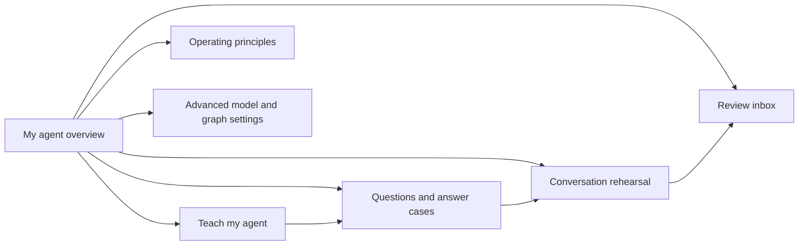
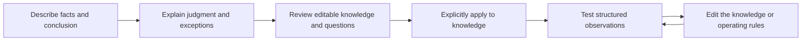
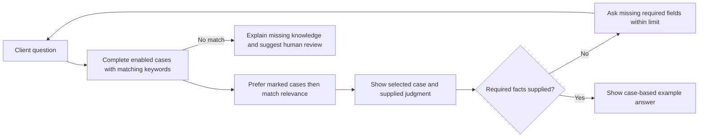
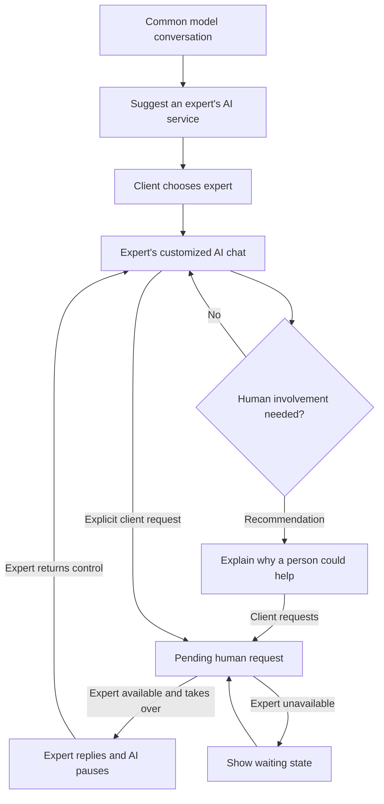
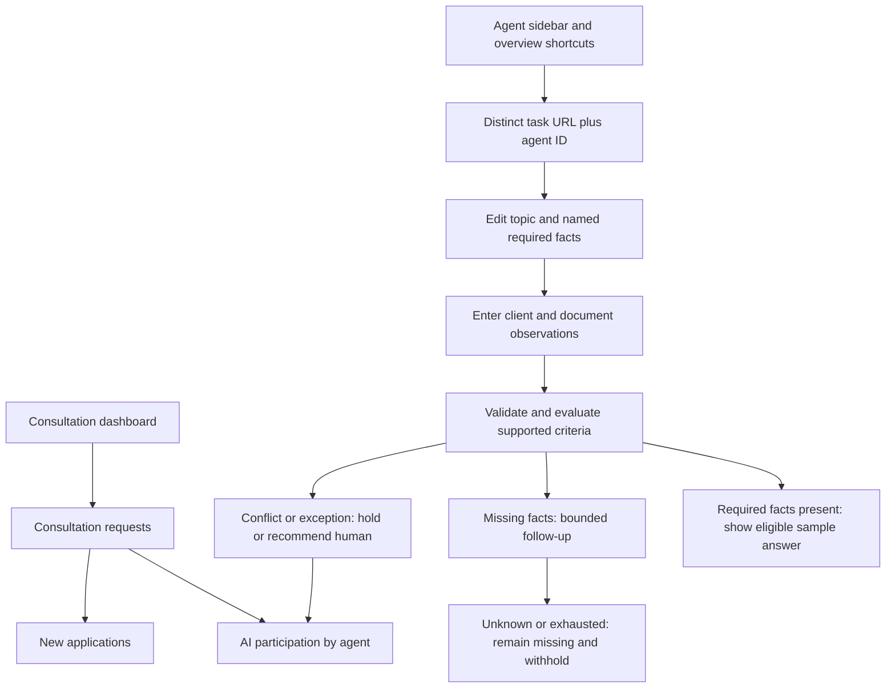

# Agent customization flows

These flows implement the [PRD](agent-customization-prd.md). All conversations in the first pass are explicitly labeled rehearsals. The product uses the same terms in navigation, guidance, and review.

## Expert navigation

## Teaching

Back navigation retains draft fields. Required information is validated before progression. Applying a draft creates one answer case and its question entries with shared provenance. Reapplying the same draft updates those entries instead of duplicating them. Unsaved work is labeled, and the main save action persists it. A storage failure retains the draft and displays a recovery action.

## Knowledge and retrieval

Search over the knowledge collection is independent of retrieval inclusion: disabled cases remain discoverable for editing, but cannot supply rehearsal answers. Cases also require a name, facts, judgment, conclusion, and keywords before they can supply an answer. A priority flag never admits an unrelated case. Shared sample material is excluded from the personal editing list and identified when used as an answer source. Structured rules use explicit observations, attempt counters, comparisons and exceptions. Free-text rules and exclusions remain recorded guidance without automatic semantic interpretation.

## Client journey and direct human participation

Selecting an expert is not presented as a promise of an immediate human reply. The second request has its own status. The inbox contains the conversation, known facts, matched case, and reason. The direct expert response appears in the same rehearsal thread with a distinct speaker label. Returning control is explicit. A pending request is retained when an expert is unavailable.

## Durable state and failure behavior

Agent selection scopes knowledge, principles, teaching drafts, and review conversations. Explicit save persists the whole library for the current demo expert. New configurations use a new ID; copies have independent practice data. Switching configurations preserves in-memory edits. Reload restores saved data. Corrupt storage is left untouched and cannot be silently overwritten; the user can retry or explicitly replace it with a sample. Storage quota failures retain current edits and allow retry.

## Responsive and keyboard flow

Desktop pairs the primary task with a contextual explanation or evidence region. Teaching uses a visible four-step sequence. At 1000px and below, task navigation becomes a labeled native selector containing all six tasks: 한눈에 보기, 가르치기, 지식 모음, 운영 원칙, 미리보기, and 참여 요청. A separate visible 참여 요청 shortcut shows the pending count beside it. The sidebar, overview shortcuts and this retained selector all navigate to the same task URLs. Participation leaves the agent route for the consultation hub, while its return link restores the selected agent. Programmatic navigation also updates the selected task. Identity, save, agent selection, and navigation remain above the scrolling work area.

Teaching, principles, rehearsal, and inbox regions stack at 1000px and below. At 700px and below, knowledge uses a list/detail switch with a 목록으로 action; selecting an entry brings its editor into view and focuses it. Task navigation brings the active task heading into view and focuses it. Native buttons, labels, selects, textareas, focus outlines, status announcements, and explicit action text support keyboard use. Motion is limited to the guidance reveal and interaction feedback and is disabled for reduced-motion preferences.

The [verification record](agent-customization-verification.md) separates domain tests, browser journeys, and the scope of the final independent review.

## Routed workspace and executable criteria

Routes: `/audit/agents`, `/audit/agents/teach`, `/audit/agents/knowledge`, `/audit/agents/principles`, `/audit/agents/preview`, `/audit/agents/advanced`; each accepts `?agent=<id>`. Participation uses `/audit/consultations?kind=participation&agent=<id>&review=<id>`; new applications use `kind=new`. Shared library state belongs to the audit layout, preserving drafts across destinations. Saving from either practice or advanced persists both together.

Knowledge questions can be copied into rule fields with a stable new field ID. Required checks evaluate field values, not keyword counts. See the [policy contract](agent-policy-contract.md) for selection precedence, follow-up counting, comparison semantics, exceptions and backend boundaries.
