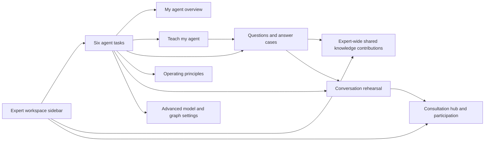
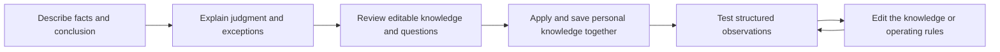
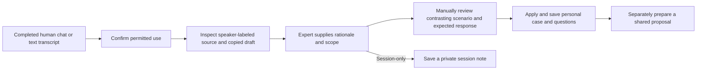
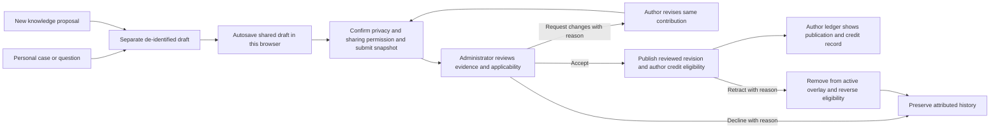
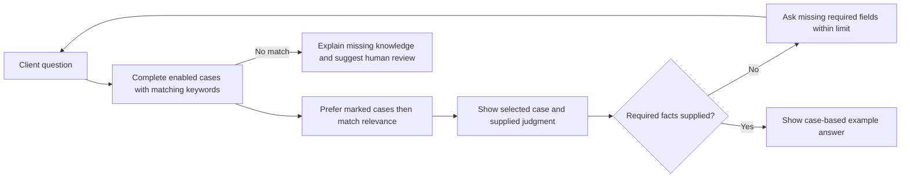
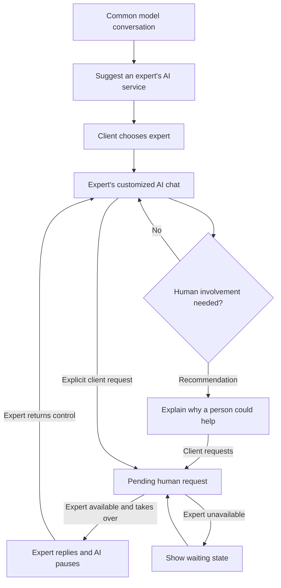
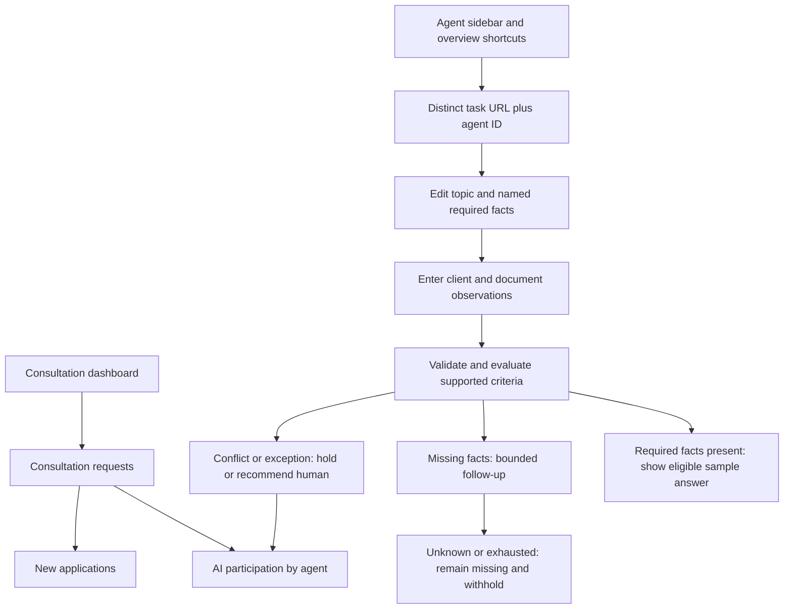

# Agent customization flows

These flows implement the [PRD](agent-customization-prd.md) and the [consultation-learning and contribution extension](session-learning-contributions.md). Generated conversations remain explicitly labeled rehearsals; private learning can also use completed local human chats or imported text transcripts. All persistence, shared publication and credit behavior is a browser-local prototype. The product uses the same terms in navigation, guidance, and review.

## Expert navigation

The sidebar owns the workspace hierarchy. There is no duplicate desktop task row; a labeled native selector provides the same six agent tasks when the sidebar is collapsed or the layout is mobile. Contributions and consultation participation have separate workspace routes and stay outside that selector.

## Teaching

`/audit/agents/teach?agent=<id>` defaults to 상담에서 배우기. `method=session|manual` records the method in the URL; overview continuation actions open the corresponding method with its retained draft. 직접 사례 들려주기 retains the original four-step flow below.

Back navigation retains draft fields and the current step in the mounted audit workspace. Required information is validated before progression. Applying a draft creates one answer case and its question entries with shared provenance, saving the resulting library before showing completion. Reapplying the same draft updates those entries instead of duplicating them. A failed storage write keeps the draft available and does not advance to a successful application. “지식 모음에서 확인” opens that exact case. Before application, “변경 저장” persists an unfinished draft for reload; unsaved edits survive client navigation only. Step changes bring the new step heading into view and focus it.

## Consultation learning

Eligible sources include closed local consultation rooms with a human expert reply, resolved participation rehearsals with an expert reply, pasted or TXT/MD text, and a labeled fictional sample. Transcript intake, including title, text and permission choice, belongs to the private agent draft before import. It survives task changes; “변경 저장” preserves it across reload. Source selection scrolls and focuses the populated import panel, and import focuses the source heading. Replacing a working lesson asks for explicit discard confirmation.

Import requires permission and client/expert speaker labels; AI speech stays separate. The organizer copies quotations into an editable draft and leaves rationale empty. It does not verify client statements or infer meaning. The expert confirms the source, scope, contrasting scenario and expected response before reusable application. This is manual review, with no model execution. Applying persists source, lesson, case and questions together; a write failure leaves input available without claiming application. Source and lesson IDs prevent duplicate application, and “지식 모음 보기” opens the applied case. Source text remains private to the browser-local agent library. Saving a session-only note does not create reusable knowledge.

## Shared proposal, review and credit

The expert-wide ledger at `/audit/contributions` shows that author's proposals across agents and has no agent Save or management toolbar. The legacy `/audit/agents/contributions` route redirects while retaining query context. Optional `agent` plus `case` or `question` parameters prepare a source choice; `contribution` opens a record and `filter` restores the list status. Preparation and detail expose “내 제안 목록” and an explicit return to the original case/question when it still exists. “새 지식 제안” starts a blank payload even when the current URL contains a source.

A shared draft is explicitly created, then its field edits autosave independently of the private agent Save action. It contains reusable content and source notes, never the private session object or raw turns. Editing it leaves personal knowledge unchanged. Both privacy and sharing acknowledgments reset after edits. A saved draft remains unsubmitted until “검토 요청”; storage failure or a stale version blocks that action until recovery.

The administrator queue at `/admin/knowledge-contributions` shows submitted records. The author cannot self-review. Publication requires a reason and checks for evidence, privacy/permission, duplicates/conflicts and applicability. Change requests permit another submitted revision; earlier snapshots, review checks and attributed events remain. Decline and retraction also retain history. Submission creates no credit; acceptance creates one publication-linked author record, and retraction reverses eligibility. 보상 검토 대상 is a local eligibility record, with no money, points or payout promise. An approved reward policy remains future work.

## Knowledge and retrieval

The knowledge URL carries `collection=cases|questions`, selected `case` or `question`, search `q`, usage filter `status` and `page`. Direct links and Back/Forward restore these values; each search edit replaces the current history entry. Overview question/case actions choose the correct collection, and lesson completion and recent-case links select their exact record. Switching agents clears prior case/question/review/contribution IDs.

Search over the knowledge collection is independent of retrieval inclusion: disabled cases remain discoverable for editing, but cannot supply rehearsal answers. Cases also require a name, facts, judgment, conclusion, and keywords before they can supply an answer. A priority flag never admits an unrelated case. Shared sample material is excluded from the personal editing list and identified when used as an answer source. Published answer and correction contributions add an ephemeral shared overlay using the approved submitted revision, with author and publication version visible in rehearsal evidence. Retracted entries leave this overlay. Question contributions remain recorded/reviewed and do not become answer cases or policy rules automatically. Structured rules use explicit observations, attempt counters, comparisons and exceptions. Free-text rules and exclusions remain recorded guidance without automatic semantic interpretation.

## Client journey and direct human participation

Selecting an expert is not presented as a promise of an immediate human reply. The second request has its own status. The inbox contains the conversation, known facts, matched case, and reason. The direct expert response appears in the same rehearsal thread with a distinct speaker label. Returning control is explicit. A pending request is retained when an expert is unavailable.

## Durable state and failure behavior

Agent selection scopes knowledge, principles, teaching drafts, and review conversations. “변경 저장” persists the whole library for the current demo expert, including unfinished private intake and practice/advanced changes. Manual/session application and private-note saving persist their resulting library in the same action and report success only after the write succeeds. New configurations use a new ID; copies have independent practice data. Switching configurations and client-side task navigation preserve in-memory edits. Reload restores saved data; it does not recover an unsaved private draft. Corrupt storage is left untouched and cannot be silently overwritten; the user can retry or explicitly replace it with a sample. Storage quota failures retain current edits and allow retry.

The contribution ledger persists separately in the same browser and is shared by local expert/reviewer views. Successful autosaves survive navigation and reload but remain drafts. Failed edits retain their payload and base version transiently in the audit provider, allowing a return through client-side navigation and “다시 저장”. Both private unsaved edits and failed contribution working copies register `beforeunload`; proceeding with reload loses unsaved changes. Each contribution mutation rereads storage and checks the expected record version. A stale detail preserves input and offers an explicit latest-content reload, confirming before discarding unsaved content. Unreadable ledger data is preserved and blocks mutation. These checks demonstrate intended contracts; they do not provide authenticated ownership, atomic cross-client transactions, private-source retention controls or production publication. See the extension's backend handoff before connecting real services.

## Responsive and keyboard flow

Desktop pairs the primary task with a contextual explanation or evidence region. Manual teaching uses a visible four-step sequence; session learning pairs source and editor. When the sidebar is collapsed or the layout is mobile, the labeled native selector contains six agent tasks: 한눈에 보기, 가르치기, 지식 모음, 운영 원칙, 미리보기, and 고급 설정. Sidebar and selector destinations match, and programmatic navigation updates the selected task. Contributions and consultation participation remain in separate sidebar groups, accessible through the mobile drawer. Participation uses the consultation hub, with a return link to the selected agent. Identity, Save, agent selection and the conditional selector remain above the scrolling work area. New/copy actions are grouped under “에이전트 관리”.

Manual teaching, principles, rehearsal, and inbox regions stack at 1000px and below. Session source/editor and contribution list/detail layouts stack at 800px and below; expert and reviewer ledgers switch between list and detail, scroll and focus a selected record, and expose a return action. At 700px and below, personal knowledge uses a list/detail switch with a 목록으로 action; selecting an entry brings its editor into view and focuses it. Task changes focus the active heading, manual step changes reveal the new step, and source selection/import reveal their destination panels. Native buttons, labels, selects, textareas, focus outlines, status announcements, and explicit action text support keyboard use. Motion is limited to the guidance reveal and interaction feedback and is disabled for reduced-motion preferences.

The [navigation follow-up](agent-navigation-review.md), [original verification record](agent-customization-verification.md) and [contribution extension record](session-learning-contributions-verification.md) separate domain checks, browser journeys, and independent review scope. The production regressions in [agent-navigation.spec.ts](../frontend/e2e/agent-navigation.spec.ts) cover teaching intake/save/resume, knowledge search and selection through Back/Forward, and exact applied-knowledge selection with a separate autosaved shared proposal.

## Routed workspace and executable criteria

Agent routes: `/audit/agents`, `/audit/agents/teach`, `/audit/agents/knowledge`, `/audit/agents/principles`, `/audit/agents/preview`, `/audit/agents/advanced`; each accepts `?agent=<id>`. Contributions use `/audit/contributions`. Participation uses `/audit/consultations?kind=participation&agent=<id>&review=<id>`; new applications use `kind=new`. Shared library state belongs to the audit layout, preserving private drafts across destinations. Saving from either practice or advanced persists both together. The agent layout also keeps Next's `children` outlet mounted for production client route transitions. The contribution ledger has independent autosave, explicit submission and an administrator review route.

Knowledge questions can be copied into rule fields with a stable new field ID. Required checks evaluate field values, not keyword counts. See the [policy contract](agent-policy-contract.md) for selection precedence, follow-up counting, comparison semantics, exceptions and backend boundaries.
