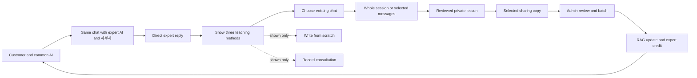

# Three act prototype demo

The demo follows one consultation from a customer's first question to a tax expert's personalized agent, then turns the expert's judgment into reusable knowledge and an attributed contribution to the common service. The audience should be able to follow the same conversation, lesson and author throughout.

Status: agreed story and browser-local implementation, updated 2026-10-07. After agreeing to the story and plan, the user authorized implementation. Open `/demo` to follow the connected customer → expert → administrator flow. Act 2 shows all three teaching methods but demonstrates only teaching from an existing chat, using the whole session or selected messages. Dialogue and timing below are the presenter script.

Companion documents: [UI readiness audit](demo-ui-audit.md) with the original gap inventory and implementation evidence, and [demo mode implementation plan](demo-mode-plan.md) with scene IDs, runtime decisions, delivery notes and verification.

Experience refinements · 2026-10-07:

- The three fictional experts have generated headshots. The selection dialog confirms the chosen person and explains that the existing conversation carries forward. Portrait generation prompts and provenance are recorded in [demo portrait prompts](demo-portrait-prompts.md).
- Confirmation introduces the expert and agent together, changes the conversation identity, and starts one personalized agent welcome. The agent has its own avatar and message bubble. Clicking the expert in the header opens their profile, specialties and consultation approach.
- Chat replies appear progressively after a typing indicator. A reload preserves partially written text and offers **응답 이어받기**; human takeover stops generation and keeps the visible partial reply. Completed text stays one transcript message. Checkpoint restoration does not replay old welcomes.
- Customer views use mint and **고객 화면**; expert views use blue and **세무사 화면**. In expert conversations, customer messages and avatars appear on the left; expert AI and direct human replies appear on the right with distinct labels and avatars.
- Teaching transcript checkboxes remain compact. The transcript uses the remaining row width on desktop and mobile.
- The common AI has a mint character, each expert agent has an illustrated counterpart with an AI label, and the customer has a distinct portrait. Agent identity stays consistent in chat, the handoff and the teaching workspace. Asset provenance is recorded in [demo avatar prompts](demo-avatar-prompts.md).
- **다음 데모 문장** sits above the composer. **문장 넣기** fills and focuses the input without sending or replacing an existing draft. **보내기** submits the reviewed text; the next suggestion follows conversation state.
- After an expert reply, the demo customer shows a typing state and replies in the same thread. A second prepared expert reply receives a closing acknowledgment. Queued replies persist across reload, complete once, and are cancelled by manual customer input, completion or return to AI. The conversation has eleven content messages after the first expert/customer exchange, or thirteen with the second exchange; all remain available for teaching.

## Stated direction

1. A customer asks the common AI a question. The AI suggests consulting a 세무사. The customer selects one; the same chat switches to that expert's agent and the expert joins. The customer continues with the agent, which reflects the expert's particular knowledge and approach. At a later point, the expert speaks directly in the same conversation.
2. The expert sees three teaching options: an existing consultation, a lesson written from scratch, and a recorded consultation. The demo selects only the existing consultation and shows how to pull the whole session or a relevant part for teaching. The expert reviews and applies one lesson, then selectively shares it with the common model.
3. An administrator reviews accumulated expert submissions, groups them into a batch, and incorporates the batch into a RAG update. Contributions remain attributable and experts receive tracked credit.

## Working choices for the demonstration

- Allow approximately 12 minutes: five for the customer, four for the expert, and three for the administrator and closing callback. Audience and presentation duration have not been specified.
- Use one fictional 병의원 customer and a recurring question about equipment used both at work and at home. This fits the current prototype's consultation and teaching examples. All quoted answers below illustrate consultation behavior, not a tax ruling.
- Preserve the existing Korean UI, Pretendard typography, luminous mint identity and solid reading surfaces. Extend the current chat and role workspaces.
- Treat joining and speaking as different states. After selection, the 세무사 is a participant with access to the context while their AI continues responding. When the 세무사 begins a direct reply, the AI pauses until explicitly handed back control.
- Make personalization visible through specific follow-up questions, organization of evidence, scope and escalation choices. A name change and a longer response alone do not demonstrate customization.
- In presenter language, say “세무사의 지식과 상담 기준을 반영한 AI.” The prototype does not perform model fine-tuning. The eventual mechanism for personalization is a separate implementation decision.
- Demonstrate local RAG update state and credit accounting explicitly as a prototype. Reward value, qualification and settlement policy remain undecided. “기여 크레딧 1건” can represent one attributed incorporation record without inventing a monetary rate.

## Act 1 The customer and the expert in one conversation

Presenter introduction: “질문은 하나의 대화에서 시작합니다. 상황이 복잡해지면, 선택한 세무사의 AI와 세무사가 그 대화에 함께 참여합니다.”

| Beat | Presenter action and proposed dialogue | What the audience should see |
| --- | --- | --- |
| Start with the common AI | Customer: “병원에서 상담용으로 산 태블릿을 집에서도 써요. 이것도 비용처리가 될까요?” | An ordinary customer chat headed `공통 AI`, with a persistent conversation identity. |
| Establish facts | Common AI: “어떤 업무에 쓰시나요? 개인적으로 사용하는 경우도 알려 주세요.” Customer: “진료 설명과 상담 자료를 보여줄 때 쓰고, 집에서는 가족도 사용해요. 구입 영수증은 있어요.” | The AI gathers facts without prematurely deciding deductibility. |
| Suggest an expert | Common AI: “업무와 개인 사용이 섞여 있어, 실제 사용 내역을 함께 검토하면 좋겠습니다. 병의원 상담을 하는 세무사와 이어가시겠어요?” | A contextual suggestion and a choice of experts inside the conversation. |
| Select a 세무사 | Select a fictional expert profile with a stated consultation approach: `사용 내역과 증빙을 먼저 확인합니다`. | The chat stays open. Earlier messages remain. New labels identify `{이름} 세무사의 AI` and `{이름} 세무사 · 참여 중`. A brief event explains that the prior context was carried forward. |
| Continue with the expert's agent | Customer: “어떤 자료부터 준비하면 되나요?” Expert AI: “앞서 말씀하신 병원 상담용 사용, 가족의 사용, 구입 영수증을 이어서 보겠습니다. 세무사님의 상담 기준에 따라 ① 업무에 사용한 상황 ② 개인 사용을 구분할 수 있는 기록 ③ 구입 증빙을 정리하겠습니다. 먼저 기록이 남아 있는 항목부터 알려 주세요.” | A response structured by that expert's teaching, retaining earlier facts and distinguishing known facts, missing evidence and next steps. An optional reference expands the relevant expert lesson. |
| Reach a judgment boundary | Customer: “영수증은 있는데 사용 기록은 없어요. 제가 기억하는 비율로 정리하면 될까요?” Expert AI: “기억하시는 내용과 확인할 수 있는 자료를 구분해 두겠습니다. 기록이 부족한 부분은 세무사님이 직접 살펴보도록 요청하겠습니다.” | A visible reason for direct involvement; the expert is already present in the thread. |
| The expert speaks | Switch presenter view to the expert's conversation and send: “지금부터 제가 직접 확인하겠습니다. 비율을 먼저 정하기보다, 남아 있는 상담 자료와 사용 상황을 함께 살펴보죠. 확인할 수 있는 자료부터 알려 주세요.” | The customer receives a message labeled `{이름} 세무사 · 직접 답변`, visibly distinct from AI. The AI is paused during direct participation. |
| Close and carry forward | Mark the synthetic consultation complete and open `이 상담으로 가르치기`. | The same consultation, including the human reply, becomes the source for Act 2. |

Presenter transition: “고객에게 한 번 설명한 판단을, 다음 상담에서도 활용할 수 있도록 남겨 보겠습니다.”

Acceptance: keep the conversation ID and full transcript through selection and takeover; retain the expert identity; show the three speaker identities explicitly; preserve state on navigation and reload; prevent an AI response from racing with a human reply.

## Act 2 The expert teaches their agent

Show the three method choices together, then follow only `상담에서 배우기`. Do not open separate manual-writing or recording workflows during the presentation.

| Beat | Presenter action | Observable result |
| --- | --- | --- |
| Show the methods | Point out `상담에서 배우기`, `직접 사례 들려주기` and `상담 녹음으로 가르치기`; select the first. | All three product options are visible. Only the consultation path is exercised. The recording option carries an accurate availability label while capture remains unimplemented. |
| Pull the existing chat | Choose the completed Act 1 consultation from the session list. | The recognizable conversation title, participants and actual transcript carry over, including the expert's direct reply. |
| Choose the teaching material | Show `전체 상담` and `일부 선택`. For the main script, choose `일부 선택` and mark the customer facts, missing-records question and expert reply. | Selected messages are highlighted with a count and speaker labels. The whole-session option stays visible; one selection produces one lesson draft. |
| Review and apply | Create a draft from the selection and add the reasoning that was not spoken explicitly. | Traceable excerpts appear beside `사실`, `판단`, `결론`, `먼저 확인할 질문`, `적용 범위` and `예외`. Apply the reviewed lesson to the expert's agent. |

Presenter line: “가르치는 방법은 여러 가지입니다. 오늘은 방금 나눈 상담을 불러와 보겠습니다. 전체 상담을 쓰거나, 필요한 대화만 골라 가르칠 수 있습니다.”

Suggested lesson derived from Act 1:

- **Title:** 업무·개인 사용이 섞인 장비의 사실 확인
- **Facts:** 업무와 개인 사용이 섞여 있고 구입 증빙은 있으나, 사용 내역을 구분하는 기록이 부족한 상담.
- **Judgment:** 고객이 기억하는 사용 상황과 자료로 확인할 수 있는 내용을 나누어 검토한다. 고객 진술만으로 확인이 끝났다고 표시하지 않는다.
- **Agent guidance:** 확인된 내용, 추가로 필요한 자료, 세무사가 검토할 부분을 나누어 안내한다.
- **Questions:** 어떤 업무에 사용했나요? 개인적으로도 사용하나요? 업무 사용을 확인할 수 있는 자료가 있나요?
- **Exception:** 자료와 설명이 다르거나 확인 가능한 기록이 부족하면 세무사에게 직접 검토를 요청한다.
- **Source:** The selected messages from this fictional demonstration consultation and the expert's explicit teaching. Retain the original conversation and message references. This is an example consultation process, not a citation to tax law.

Show a short before/after probe using a variation such as “상담용 노트북을 집에도 가져가는데 사용 기록은 따로 없어요.” The saved lesson should visibly change the questions or response organization, and the preview should identify the lesson actually used. Do not describe a preset response unrelated to the edited lesson as evidence of learning.

Writing from scratch remains an existing alternative. Recording appears in the method chooser as a planned option; capture, playback and transcription are outside this demo's delivery scope. No audio asset or microphone setup is required.

### Selective sharing

Show the newly applied lesson alongside a clearly prepared, pre-existing private lesson. Select only the reusable facts-and-evidence lesson for sharing; leave the expert's practice-specific handling lesson private. Open a separate editable sharing copy, remove identifying source details, show the reusable scope and rationale, and submit it for review. Creating a second lesson live is not part of the script.

The proposed contribution contains the selected knowledge and author attribution. It does not contain the full consultation or the expert's other private lessons. Saving to the expert's agent, creating a sharing copy, and submitting that copy remain separate actions.

Presenter transition: “내 에이전트에 가르친 내용을 전부 공개하는 것은 아닙니다. 함께 활용할 수 있는 지식만 골라 제안합니다.”

Acceptance: all three method choices are visible; only consultation teaching is demonstrated. The source is Act 1's actual synthetic transcript. Whole-session and selected-message import both work; the selected excerpt retains speaker identity, chronological order and original message references. Only selected messages enter the draft, and the saved lesson affects a subsequent preview. Only explicitly submitted knowledge appears in the administrator's queue.

## Act 3 Review a batch and account for contributions

Open the admin workspace with the Act 2 submission alongside clearly marked synthetic submissions from other experts. Include one submission needing revision, so the audience can see why collection and incorporation are different steps.

| Beat | Presenter action | What the audience should see |
| --- | --- | --- |
| Review | Open the new submission and check its rationale, source, applicability, privacy and overlap with existing knowledge. Approve it for a batch. Send an incomplete submission back for revision. | Each item retains its expert author, originating lesson, submitted revision and review record. Review approval does not yet change the active RAG version. |
| Build a batch | Select approved submissions, including Act 2's lesson. Name a batch, for example `병의원 상담 지식 업데이트 01`. | A manifest lists the exact contribution revisions and authors to incorporate. Pending and returned submissions remain outside the batch. |
| Apply the update | Start the prototype update, then show the batch as incorporated and the active knowledge version changing. | A batch ID, version, included items and completion record. Errors leave the previous version active and allow retry. |
| Account for credit | Open the contribution ledger and the selected expert's record. | The author is linked to the contributed lesson, exact revision and completed batch. Credit is awarded once when incorporation completes; retrying does not duplicate it. |
| Close the loop | Return to the common AI and ask a related question. Expand its knowledge reference. | The shared guidance is available after the update and points to the contributed knowledge and author. The expert's unshared lesson remains private. |

Presenter close: “한 번의 상담에서 나온 전문가의 판단이 개인 에이전트를 개선하고, 선택적으로 공유된 지식은 검토와 반영을 거쳐 공통 서비스에도 돌아옵니다. 그 기여는 작성자에게 연결됩니다.”

Acceptance: submitted → reviewed → batched → incorporated states remain distinct; batch contents are fixed to reviewed revisions; failed or repeated updates cannot issue duplicate credit; the common AI demonstrably uses incorporated shared knowledge; the expert can see their own contribution and credit history.

## Original capabilities and implementation targets

The table below preserves the pre-implementation comparison that guided the work. Its demo targets are now connected through the isolated run; ordinary prototype sessions retain their prior behavior. The detailed [UI readiness audit](demo-ui-audit.md) owns the implementation evidence and remaining production boundaries.

| Required moment | Current implementation | Work needed for the target demo |
| --- | --- | --- |
| Customer asks the common AI | `/` and `/chat/clinic?c=…` use persisted local conversations and sample replies. | Prepare and rehearse the chosen scenario. |
| Customer selects an expert | Chat contains an expert directory and a consultation request flow. | Selection must attach the expert and their agent to the existing customer thread. |
| Expert-specific AI and human replies in the same customer chat | `/audit/agents/preview` simulates the common-AI → expert selection → expert-agent journey; `/audit/consultations?kind=participation` supports direct expert takeover of rehearsal requests. | Bridge these behaviors to the customer's existing conversation rather than opening an unrelated rehearsal. Add joined/observing and actively replying states. |
| Show three teaching methods | The method chooser has consultation and manual-writing options; recording is absent. | Add the recording option with an accurate availability label. Preserve the manual route; demonstrate only consultation teaching. |
| Pull a whole consultation or selected messages | `/audit/agents/teach?method=session` loads entire completed room consultations and resolved expert rehearsals; TXT/MD imports and sample transcripts also work. | Expose the completed Act 1 chat, then add whole-session/selected-message controls and a selection preview preserving source IDs, speakers and order. |
| Review and apply one lesson | The consultation editor already supports source review, expert rationale, scope, variation and private application. | Generate its draft from the chosen source scope and retain source references through application. |
| Selective sharing | `/audit/contributions` stores independent proposals, immutable submitted revisions, acknowledgments and attribution. | Prepare private and shared examples and verify their separation across the demo. |
| Admin review | `/admin/knowledge-contributions` reviews and publishes individual proposals. | Add a reviewed state and batch selection before incorporation. |
| RAG batch update | `withSharedKnowledge` overlays individually published answer/correction cases in expert rehearsal. `/admin/pipeline/batches` is a statistics/toggle screen, not a batch builder. | Add batch/version state and connect the completed update to the common chat. Published question contributions currently do not enter that answer overlay. |
| Credits | Individual publication creates an eligibility record; retraction reverses eligibility. An older numeric credit screen exists at `/audit/ledger`, with a different data model. | Connect incorporated contributions to that ledger presentation and expose its navigation. The plan proposes a labeled demo unit; production value and monetary settlement remain undefined. |
| Reliable presentation reset | Existing sample/empty/slow/error scenarios and browser-local persistence support development. | Add a bounded demo reset and saved checkpoints for the three acts, without deleting unrelated browser work. |

Relevant implementation sources:

- [Customer chat](../frontend/components/chat/local-chat-experience.tsx), [conversation store](../frontend/lib/entry-chat.ts), and [expert handoff](../frontend/components/chat/expert-handoff-block.tsx).
- [Expert rehearsal and direct participation](../frontend/components/audit/agents/practice-rehearsal.tsx).
- [Manual teaching](../frontend/components/audit/agents/practice-teaching.tsx) and [consultation teaching](../frontend/components/audit/agents/session-teaching.tsx).
- [Contribution lifecycle](../frontend/lib/knowledge-contributions.ts), [administrator review](../frontend/components/admin/knowledge-contributions.tsx), and [shared retrieval overlay](../frontend/lib/shared-knowledge.ts).

## Implementation order

1. Create an isolated demo run and runtime adapters for the existing screens, with a minimal launcher and reliable persistence.
2. Connect the customer thread, selected expert agent and human participation. Make the original transcript the common source of truth and expose the completed conversation to teaching.
3. Show the three teaching methods and complete the consultation path: select the Act 1 session, choose all or some messages, review and apply one lesson, then run a repeatable before/after preview. Reuse the private lesson and contribution contracts; seed a separate private lesson for the sharing contrast.
4. Extend individual review into immutable batches and versioned incorporation. Issue idempotent credit records tied to the completed batch, then make incorporated knowledge visible to the common chat.
5. Finish presenter checkpoints and controls. Rehearse the whole path with the same synthetic identities and verify navigation, reload and failure recovery. See the [implementation plan](demo-mode-plan.md) for acceptance gates.

## Presenter preparation

- Start the frontend with `cd frontend && npm run dev`; the default local URL is `http://localhost:3015`.
- Open `http://localhost:3015/demo` and choose `처음부터 시작`. The prepared expert is `윤서진 세무사`; login is not required for the isolated demo. `이어서 보기` restores the last view and saved work.
- Present customer → expert → administrator sequentially in one tab using `발표 도구 열기`. These viewpoints use the run's fictional actors and preserve the normal account. Another tab must explicitly take over before editing the same run.
- In chat, use `문장 넣기` next to **다음 데모 문장**, edit if needed, then `보내기`. The expert view receives prepared customer replies automatically. Presenter `예시 문장 넣기` remains available for lesson review; the sharing form has `예시 공유 문장 넣기` and admin review has `예시 검토 의견 넣기`. Review acknowledgments remain explicit clicks.
- `선택 장면 복원` replaces this run with a prepared scene after confirmation. It preserves unrelated browser data. Checkpoints are prepared states, not evidence that skipped actions were performed live.
- Prepare the Act 1 source checkpoint and the intended message selection. Verify that selected facts and the human reply are enough to review the lesson, and keep the whole-session option visible.
- Keep unrelated customer/teaching data outside the reset scope. Verify the opening checkpoint twice and the complete three-act path once before presenting.
- Introduce the simulation boundary once: “브라우저에서 상담과 지식 운영 흐름을 시연하는 프로토타입입니다.” Retain the interface's sample labels. Describe model execution, transcription, RAG deployment and rewards only to the extent actually demonstrated.

## Open product decisions

The target sequence above follows the requested three acts. The remaining choices are presentation audience and duration, what numeric value or unit a credit represents, and whether personalization will ultimately use RAG, prompts, model fine-tuning or a combination. Recording and transcription remain future product decisions outside this demo scope. None is required to agree on the flow; each needs resolution before making corresponding production claims.
