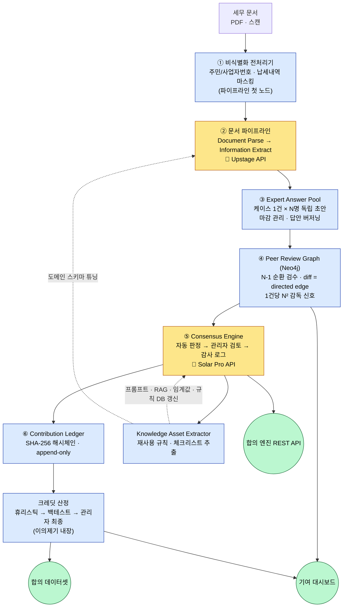
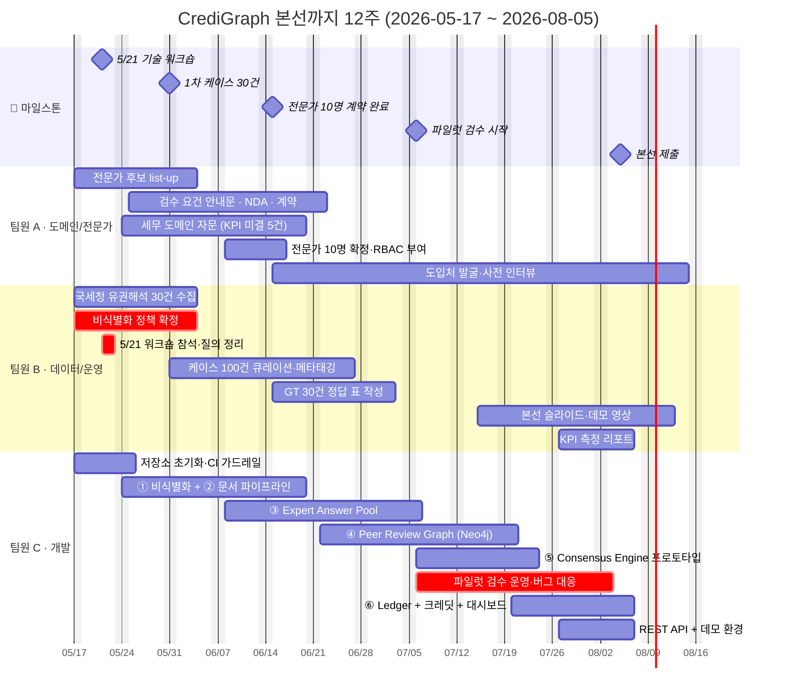
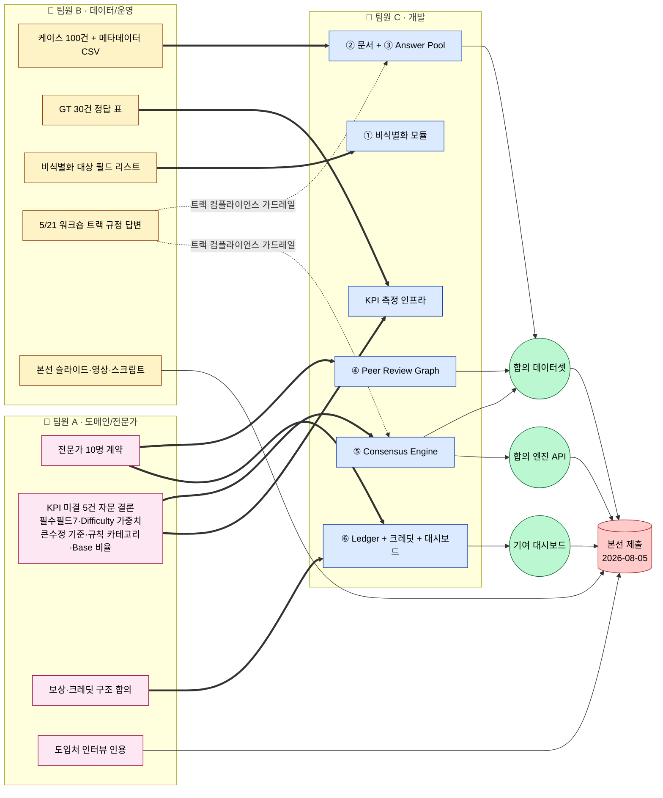

# 구현 워크플로우 · 일정 · 협업 다이어그램

> 팀: 네오러다이트 · 프로젝트: CrediGraph
> 작성: 2026-05-17 · 본선 데드라인 2026-08-05
> 입력 문서: [260516 프로덕트 설계](../260516%20프로덕트%20설계.md), [구현 제안서](서식0__구현제안서_챔피언_네오러다이트.md), [팀 협업·업무분담](팀_협업_업무분담.md)

본 문서는 위 세 문서를 (1) 구현 워크플로우, (2) 3개월 일정·팀별 스윔레인, (3) 팀 간 산출물 핸드오프 — 세 개의 다이어그램으로 정리한 것이다. 상세 디테일은 미팅을 통해 조정한다.

---

## 1) 구현 워크플로우 — 6개 컴포넌트 + 시스템 러닝 루프

> 노란색 = Solar Pro API 호출 지점 (2곳뿐), 파란색 = 우리가 짜는 코드/스키마/알고리즘 (80%), 초록색 = 본선 산출물 3종.

---

## 2) 3개월 일정 — 팀별 스윔레인 간트

> 빨간색(crit) = Critical Path — 늦으면 본선 산출물이 도미노로 무너지는 항목.

---

## 3) 팀 간 산출물 핸드오프 — "누구의 산출물이 누구를 풀어주는가"

---

## 핵심 읽는 법

- **워크플로우(1)**: LLM 호출은 ②·⑤ 단 2곳, 나머지 4개 컴포넌트와 KA→프롬프트/RAG 피드백 루프가 "시스템 러닝"의 실체.
- **간트(2)**: A의 *전문가 10명*(6/15)과 B의 *케이스 100건*(6/15) 두 사람의 산출물이 6월 중순에 동시 도착해야 C의 ④ Peer Review Graph가 빈손이 아닌 채로 시작 가능. 여기서 한 주만 밀려도 7/6 파일럿 시작이 깨짐.
- **핸드오프(3)**: A의 *자문 결론*은 C의 ⑤·KPI 둘 다에 입력. B의 *비식별화 정책*은 ①의 코드 직전제. B의 *5/21 워크숍 답변*은 트랙 컴플라이언스 가드레일로 ②·⑤에 반영.
