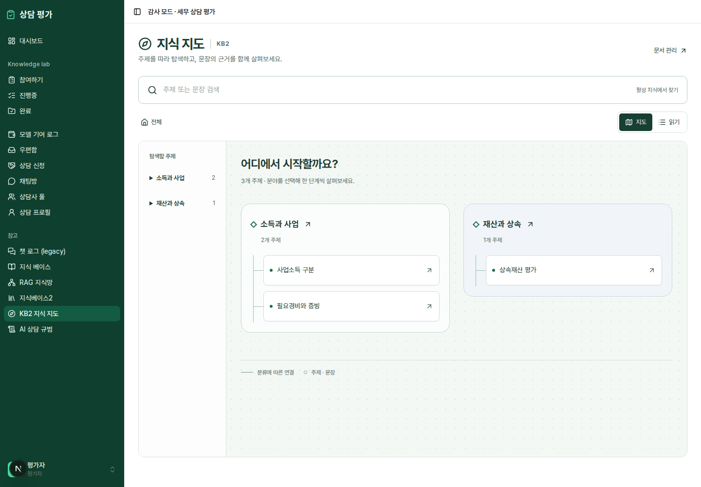
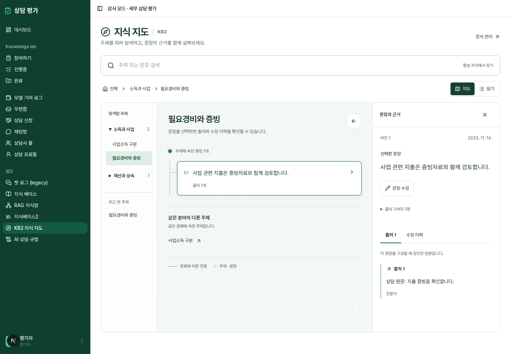

# KB2 knowledge atlas

Open **KB2 지식 지도** in the auditor sidebar, or **지식 지도 열기** in the existing KB2 manager. Route: `/audit/kb2/atlas`.

The additional view organizes existing KB2 categories, documents, statements, and source passages into a stable hierarchy. Category regions lead to document neighborhoods, then statements and an evidence inspector. Map and reading views share URL selection (`group`, `document`, `sentence`, `view`), browser history, and session-scoped recent topics. Mobile uses a compact topic selector and puts selected evidence before the map.





[Mobile evidence view](mobile.png)

## Behavior and boundaries

- Search matches literal text in active KB2 statement content or document titles, with a 300ms debounce and up to 40 results. Retired, archived, and unsorted documents and retired statements are excluded. Search does not call an embedding model. Wildcard characters are treated literally.
- Connections represent taxonomy and provenance. Same-category neighbors are labeled as such. No inferred contradictions, legal validation, or confidence scores are displayed. Contribution percentages are explained as source attribution.
- Sources and version history use existing APIs. Original consultation links are not fabricated because the current source contract does not provide them.
- Editing acquires the existing server lock and reacquires it before saving. The optional `expectedVersion` PATCH field atomically checks version and lock ownership. A mismatch returns 409; clients that omit the new field retain the existing API behavior.
- Failed saves keep the editor open. Drafts are retained in session storage, scoped by auditor and sentence, until saved or explicitly discarded. Returning to a sentence and choosing Edit restores its draft. Storage-disabled browsers still keep drafts in memory and receive a copy-before-leaving notice.
- No automatic save timer: experts explicitly save their changes. On navigation/unmount, the view releases its editing lock where possible; the existing server lease handles interrupted connections.
- The existing KB2 manager remains available for taxonomy maintenance and disconnection. This change does not replace its editor.
- No new runtime dependencies or database migration. Deploy the backend and frontend together for corpus search and version-checked editing.

## Verification

From `frontend/`, start `npm run dev -- --port 3012`, then run:

```sh
npx playwright test e2e/kb2-atlas.spec.ts --timeout=30000
npx tsc --noEmit
npm run build
```

The atlas browser suite intercepts all external HTTP/WebSocket traffic, uses synthetic content, and never writes live records. It covers navigation, deep links, reading/map selection, browser Back, evidence, search/mobile viewport, failed-save retry, version conflict, draft restoration, lock denial, load recovery, empty data, and stale document responses. Screenshots above are synthetic fixture captures, not production content.

From the repository root, install the backend API dependencies and `httpx` in a virtual environment, then run:

```sh
PYTHONPATH=backend backend/.venv/bin/python -m unittest discover -s backend/tests -v
```

The SQL tests execute search and version-guard queries on disposable SQLite tables with PostgreSQL cast/time syntax adapted. They check active-only search, literal wildcards, bounds, stale versions, lock ownership, and revision recording. HTTP tests exercise FastAPI with storage/embedding boundaries stubbed. They do not establish production PostgreSQL performance or end-to-end production authentication.

The unrelated `session-eval-review.spec.ts` suite requires live Supabase, invokes embeddings, and changes review/ledger/RAG records; it is not part of the isolated atlas verification. The existing sync suite also requires a live login environment.

Repository-wide lint currently reports **31 errors and 10 warnings**, identical to an independent run on `origin/main` at `d67f310`. The new atlas files and changed service/sidebar/route files pass targeted ESLint. Existing violations in `kb2-view.tsx` predate its added atlas link.
