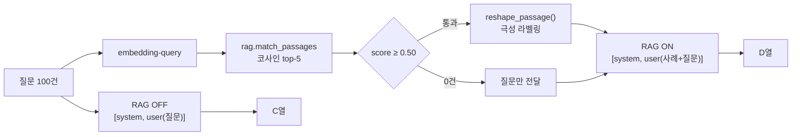
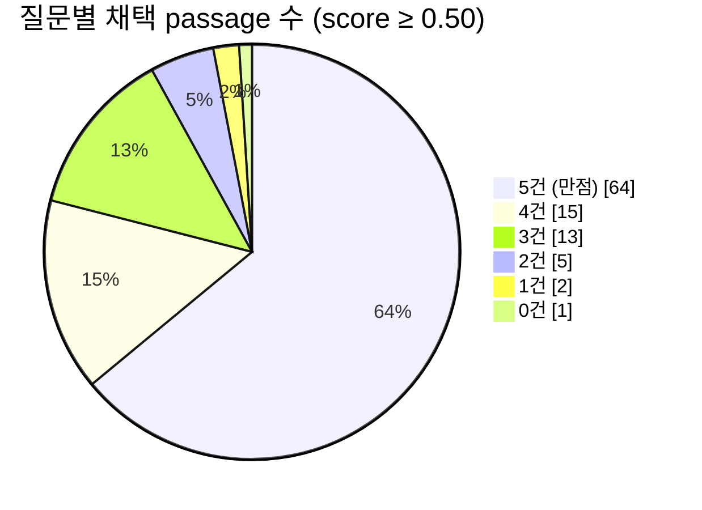
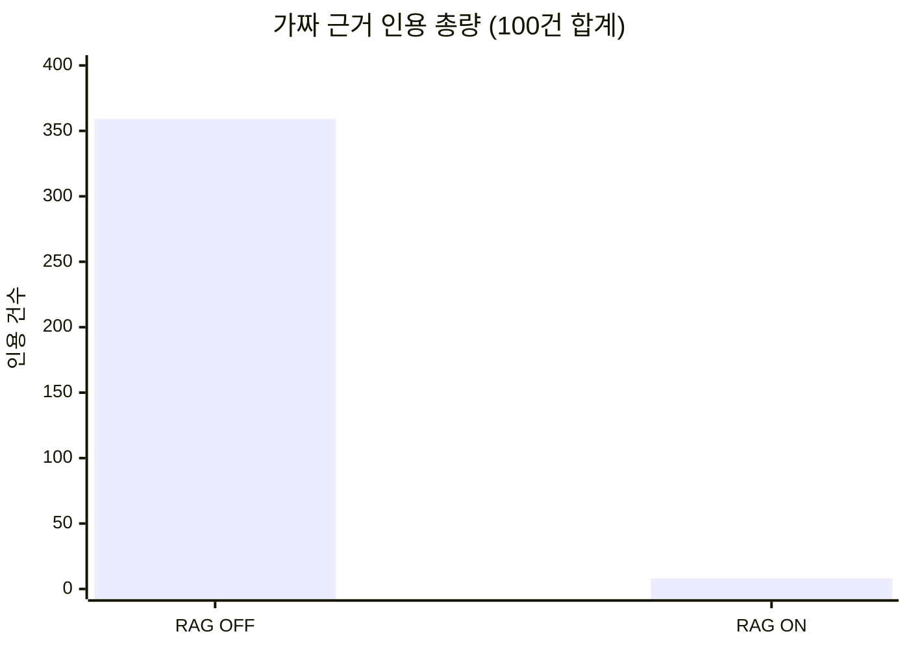
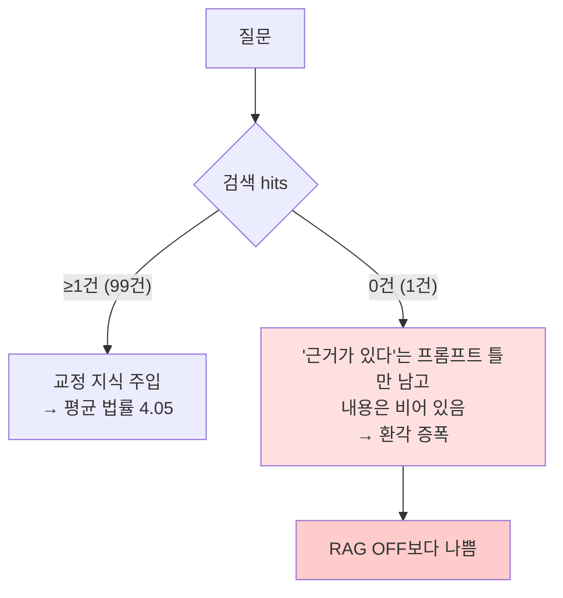

# RAG ON/OFF 성능평가 리포트 — 병의원 세무상담 100문항 A/B

작성일: 2026-07-19
대상: `upstage bulk 답변.csv` (no / 질문 / RAG OFF / RAG ON)
모델: Upstage `solar-pro3`, temperature 0.3 (양측 동일)
KB: `rag.passages` active 526건 (feedback 354 · session_eval 164 · case_seed 8)

> ## 🔴 정정 (2026-07-19, 같은 날 후속 실험)
> 미학습 30문항 + 영(null) 대조군 n=24 실험으로 이 리포트의 두 곳이 보정됐다.
> **[260719_미학습질문30건_RAG_ONOFF_영대조군검증_누출보정.md](260719_미학습질문30건_RAG_ONOFF_영대조군검증_누출보정.md)를 함께 읽을 것.**
>
> 1. **효과 크기 과대.** 누출 없는 세트에서 Δ법률정확성은 **+3.03이 아니라 +0.40**(RAG 발동분만 +1.17)이다. 이 리포트의 수치는 대부분 §6 질문 누출이 만든 것이다.
> 2. **§5 주장 철회.** *"RAG는 검색이 실패한 자리에서 RAG OFF보다 안전하지 않다"* 는 **틀렸다.** n=1(no.1)로 내린 결론이었고, n=24 영 대조군에서 p=0.481로 유의차가 없다. 또 `build_user_prompt()`는 `if not passages: return question` 이라 hits=0이면 주입 틀 자체가 붙지 않는다 — 메커니즘 설명도 코드 오독이었다. §8의 P1 "hits=0 분기 추가"도 **불필요**하다.
>
> **유효한 채로 남는 것:** 가짜 근거 인용 359 → 8건(§3), P5 100 → 2건(§4). 카운트 지표는 후속 실험에서도 같은 방향으로 재현됐다(발동 영역 32 → 0건).

---

## 0. 요약 — 무엇이 측정됐고 무엇이 측정되지 않았나

| | RAG OFF | RAG ON |
|---|---:|---:|
| 문장력 (5점) | 2.29 | **3.85** |
| 법률정확성 (5점) | 1.00 | **4.03** |
| 우세 판정 | 1건 | **99건** |
| 가짜 근거 인용 (총량) | **359건** | **8건** |
| 가짜 근거 포함 답변 | **99 / 100** | **2 / 100** |

**✅ 이 실험이 증명하는 것**
세무사가 한 번 교정한 내용은 다음 답변에 재현된다. 특히 **가짜 조문·판례가 실질적으로 소멸한다**(P5: 100/100 → 2/100).

**❌ 이 실험이 증명하지 않는 것**
처음 보는 질문에서 RAG가 더 정확하다는 것. **100문항 중 98개가 KB passage 안에 그대로 들어 있다** — KB는 바로 이 질문들을 감사해서 만들어졌기 때문이다. 이 조건에서 얻은 수치는 **폐루프 반영률**이지 일반화 성능이 아니다.

> 본선 자료에 쓸 수 있는 문장은 **"세무사 1회 교정이 동일 질문군에서 재현된다"** 까지다.
> "RAG로 정확도가 올랐다"는 leakage 반박을 그대로 맞는다. → §6

---

## 1. 실험 설계

### 1-1. 변수를 RAG 하나로 고정

C열 생성기 `bulk_ask.py`의 `SYSTEM_PROMPT` · 모델 · temperature를 **그대로 import** 해서 D열 생성기 `bulk_ask_rag.py`를 만들었다. 두 스크립트의 유일한 차이는 사용자 메시지에 검색 결과가 붙는지 여부다.



제품 파이프라인(`api/pipeline.py`)을 통째로 태우지 않은 이유: 라우팅·후처리가 섞이면 차이를 RAG에 귀속시킬 수 없다.

### 1-2. 채점 방법과 그 한계

- 루브릭: **문장력 5점 · 법률적 정확성 5점** (기존 감사 포맷과 동일), 각 건 독립 시행
- 파일럿 5건(no.9·14·21·38·55)을 먼저 채점해 눈금을 고정 → 260712의 기존 세무사 점수와 **3/5 정확 일치, 2/5 ±1**
- 나머지 95건은 8개 병렬 에이전트가 동일 루브릭 + 검증된 법령 미니 KB + P1–P12 사전으로 채점
- 에이전트에게 명시 지시: *"눈금에 맞추려 점수를 조작하지 말 것. RAG ON이 나쁘면 나쁘게 줄 것"*

> ⚠️ **한계를 분명히 한다.** 최종 채점자는 사람이 아니라 LLM이다. 사람(세무사) → 파일럿 5건 → 에이전트 95건으로 이어지는 **2단 캘리브레이션**이고, 단계마다 드리프트 여지가 있다. 점수(2.29 vs 3.85)보다 **가짜 근거 카운트(§3)** 가 검증 가능한 지표라 그쪽을 주 근거로 삼는 게 안전하다.

### 1-3. 검색 실적



채택 score: min 0.501 / 중앙 **0.648** / max 0.805
채택 출처: `feedback` 280 · `session_eval` 151

> 이 score가 높은 것 자체가 leakage의 증상이다. 의미가 유사해서가 아니라 **질문 문자열이 거의 같아서** 걸린 건이 다수다.

---

## 2. 점수 결과

### 2-1. 평균

```mermaid
xychart-beta
    title "RAG OFF vs ON 평균 점수 (5점 만점)"
    x-axis ["문장력", "법률적 정확성"]
    y-axis "점수" 0 --> 5
    bar [2.29, 1.00]
    bar [3.85, 4.03]
```



<sub>앞 막대 = RAG OFF, 뒤 막대 = RAG ON</sub>

### 2-2. 분포 — 평균보다 이쪽이 중요하다

**법률적 정확성**

| 점수 | 1 | 2 | 3 | 4 | 5 |
|---|---:|---:|---:|---:|---:|
| RAG OFF | **100** | 0 | 0 | 0 | 0 |
| RAG ON | 1 | 1 | 14 | **62** | **22** |

**문장력**

| 점수 | 1 | 2 | 3 | 4 | 5 |
|---|---:|---:|---:|---:|---:|
| RAG OFF | 0 | **71** | 29 | 0 | 0 |
| RAG ON | 0 | 1 | 14 | **84** | 1 |

> **RAG OFF의 법률정확성이 100건 전부 1점이다.** 바닥 효과(floor effect)이므로 Δ+3.03을 "3배 향상"처럼 배수로 표현하면 안 된다. 정직하고 동시에 더 강한 서술은 이것이다 — **"RAG OFF는 100건 중 예외 없이 법적 근거가 무효였다."**

### 2-3. 판정

| | 건수 |
|---|---:|
| ON 우세 | **99** |
| OFF 우세 | 1 (no.1) |
| 동률 | 0 |

---

## 3. 가장 단단한 지표 — 가짜 근거 인용

채점 에이전트에게 답변마다 환각 인용을 **열거**하게 했다(사건번호 형식 이상 · 조문 표제 불일치 · 출처 미상 예규 · 실재하지 않는 고시).



| | RAG OFF | RAG ON |
|---|---:|---:|
| 가짜 근거 인용 총량 | 359 | **8** |
| 하나라도 포함한 답변 | 99 / 100 | **2 / 100** |
| 답변당 평균 | 3.59 | 0.08 |

**전형적인 RAG OFF 환각:**

```
대법원 2015다12345          ← 일련번호가 자리표시자
대법원 2005다12345
국세청 예규 2022-12-01       ← 출처 자체가 없음
한국세무학회 '세무실무 가이드 2023'
부가가치세법 시행령 제2조(과세대상 서비스)   ← 조문 번호와 표제 불일치
소득세법 제22조(기부금의 손금산입)          ← 실제는 §34
```

RAG ON에 남은 8건은 **2개 답변에 집중**되어 있고, 그중 7건이 **no.1**(검색 미스, §4)이다.

---

## 4. 반복오류 사전(P1–P12) 대조

260712에서 정의한 반복오류 taxonomy를 A/B 축으로 그대로 적용했다.

```mermaid
xychart-beta
    title "패턴별 발생 건수 (100건 중)"
    x-axis ["P5 가짜조문판례", "P7 한도방향오류", "P2 템플릿환각", "P9 산술오류", "P8 성급단정", "P10 안분오적용", "P6 근로소득누락", "P12 자기모순"]
    y-axis "건수" 0 --> 100
    bar [100, 50, 28, 28, 13, 7, 7, 4]
    bar [2, 2, 5, 1, 2, 3, 0, 4]
```



<sub>앞 막대 = RAG OFF, 뒤 막대 = RAG ON</sub>

| 패턴 | 설명 | OFF | ON | Δ |
|---|---|---:|---:|---:|
| P5 | 가짜/오인용 조문·판례 | **100** | 2 | −98 |
| P7 | 한도·특례 방향 오류 | 50 | 2 | −48 |
| P2 | 템플릿 환각 | 28 | 5 | −23 |
| P9 | 산술·인정금액 오류 | 28 | 1 | −27 |
| P8 | 성급 단정·되묻기 부재 | 13 | 2 | −11 |
| P10 | 안분 프레임 오적용 | 7 | 3 | −4 |
| P6 | 근로소득 과세 누락 | 7 | 0 | −7 |
| P3 | 접대비 부인 오적용 | 4 | 0 | −4 |
| P12 | 판정 자기모순 | 4 | 4 | 0 |
| P4 | 적격증빙 부인 오적용 | 2 | 0 | −2 |

**P12(자기모순)만 줄지 않았다.** 4건 그대로다. 검색된 교정 지식이 답변 앞부분의 결론과 뒷부분의 단서를 서로 어긋나게 만드는 경우로, RAG로는 안 잡히는 계열이다.

> **집계 방식에 대한 주의.** 초기에 만든 키워드 자동 집계(`ab_tally.py`)는 **결론이 뒤집혀 나왔다.** *"'적격증빙 미보유 → 손금부인'이라는 논리는 성립하지 않습니다"* 같은 **교정 문장**을 오류로 세기 때문이다(극성 맹목). 비판 어휘와 오류 어휘가 같아서 생기는 구조적 한계라, 위 표는 전부 **읽고 판단한 결과**이고 키워드 집계는 교차검증용으로만 남겼다.

---

## 5. RAG가 진 유일한 건 — no.1

**검색 hits=0인 유일한 건이 곧 OFF 우세로 판정된 유일한 건이다.** 우연이 아니다.

| no.1 | 문장력 | 법률정확성 | 가짜근거 | 패턴 |
|---|---:|---:|---:|---|
| RAG OFF | 3 | 1 | 2 | P5·P7·P10 |
| RAG ON | 2 | 1 | **7** | P5·P12·P7·P10 |

0.50 컷을 넘는 passage가 없어 순수 생성으로 떨어졌고, **가짜 조문 4개 + 가짜 판례 3개 + 자기모순**을 냈다. RAG OFF보다 나빴다.



> **RAG는 검색이 실패한 자리에서 RAG OFF보다 안전하지 않다.** "참고 자료를 근거로 답하라"는 지시만 남고 자료가 비면, 모델이 그 빈자리를 지어내서 채운다. hits=0일 때는 주입 문구 자체를 제거하거나 "확인 필요"로 강제하는 분기가 필요하다.

### 5-1. RAG ON에 남은 약점 — 내용은 맞는데 조문 번호가 없다

채점 에이전트들이 공통으로 지적한 ON의 감점 사유 1위가 **"조문 미인용"** 이다. 법률정확성 3점대 14건이 대부분 여기 걸린다.

환각을 막기 위해 프롬프트에 *"자료에 없는 법령·판례·수치를 지어내지 마세요"* 를 넣은 것의 부작용이다 — **인용 능력 자체가 눌렸다.** 정확성과 인용력의 트레이드오프가 지금은 정확성 쪽으로 과하게 기울어 있다.

문장력 3점 이하 15건(no.1·7·19·24·34·43·47·57·62·63·69·73·84·89·97) 중 상당수도 같은 계열이다.

---

## 6. ⚠️ 이 리포트를 인용할 때의 제약 — 질문 누출

**100문항 중 98개가 KB passage 안에 문자열 그대로 존재한다.**


시험 문제와 정답지가 같은 파일에 있는 구조다. 그래서 99/100이라는 판정은 엄밀히는 **"검색 파이프라인이 고장나지 않았다"** 에 가깝다.

### 6-1. 다음 실험이 나눠야 할 세 층위

| 층위 | 정의 | 측정 가치 | 이번 실험 |
|---|---|---|---|
| ① | 질문 문자열이 KB에 그대로 | **없음** (정답지 조회) | **98건** |
| ② | 질문은 다르나 주제가 KB 안 | **핵심** — 제품이 실제 하는 일 | 미측정 |
| ③ | 주제 자체가 KB 밖 | **필수** — no.1 실패 모드 구간 | 1건(no.1) |

②와 ③을 섞어 평균 내면 **KB 커버리지 비율이 성능처럼 보이는** 또 다른 왜곡이 생긴다. 반드시 분리 보고해야 한다.

권장 구성: 30건 내외, ② 20건 / ③ 10건. 질문 출처는 **KB를 보지 않은 상태에서** 확보해야 선택 편향이 안 생긴다(원장 실제 문의 > 커뮤니티 > 생성).

---

## 7. 부록 — 실험 도중 발견·수정한 구조 결함

성능 측정 전에 RAG ON 쪽 구조 버그를 먼저 잡았다. 상세는 별도 작업 로그 참조:
[260719_RAG_ONOFF_100건AB_오염전파차단_가짜근거359to8.md](260719_RAG_ONOFF_100건AB_오염전파차단_가짜근거359to8.md)

### 7-1. 오염 전파 — KB가 교정 지식과 함께 오류도 주입하고 있었다

`ingest.build_bundle_text()`가 만드는 KB 번들에는 **세무사가 "틀렸다"고 지적한 그 답변**이 `[AI 답변]` 블록으로 들어 있다. 이걸 극성 표시 없이 통째로 주입하면 모델이 그 안의 가짜 근거를 권위로 착각한다.

| 토큰 | ✗ [AI 답변] 블록 | ✓ [세무사 코멘트] 블록 |
|---|---:|---:|
| 소득세법 §35 | 70 | 18 |
| 조심2025구1960 | 11 | 14 |

`reshape_passage()`로 주입 직전 극성 라벨을 박아 해결:

| 지표 | OFF | ON v1 (오염) | ON v2 (본 리포트) |
|---|---:|---:|---:|
| 가짜근거(§35·조심1960) | 0 | 3 | **0** |
| 스캐폴딩 누출(`[질문]` 등) | 0 | 7 | **0** |
| "참고 지식에 따르면" 인용체 | 0 | 61 | **1** |
| 길이 중앙값(자) | 3,889 | 1,479 | 736 |

### 7-2. 🔴 제품에는 이 구멍이 아직 열려 있다

`backend/api/llm.py`의 `write_segments` / `write_advisory`는 **`p.content`를 원문 그대로 주입**한다. 실험에서 재현·증명된 오염 경로가 프로덕션에 그대로 있다. **P0 수정 대상.**

### 7-3. KB 내부의 나쁜 데이터 3건 (승인 후 은퇴)

`session_eval` passage 3건이 가짜 사건번호를 *"실존 케이스로 치환"* 하라고 권장하고 있었다. 권위 블록(세무사 코멘트) 안에 있어 구조적 필터로는 못 걸러진다.

```
active 529 → 526 · retired 0 → 3 · session_eval 167 → 164
auditor 기여 240 → 237
ledger_entries 무변동 (contribution_accepted 270 / rejected 6)
```

ledger가 안 움직인 것이 설계대로다 — 적립 크레딧은 남고 "살아 있는 기여"만 감소한다.

---

## 8. 결론과 다음 행동

**말할 수 있는 것**
1. 세무사 교정이 KB를 거쳐 답변에 재현된다. 가짜 근거 **359 → 8건**, 포함 답변 **99% → 2%**.
2. P5(가짜 조문·판례)가 사실상 소멸했다(100 → 2).
3. 이는 **폐루프 반영률**의 증명이며, 일반화 성능은 아직 미측정이다.

**해야 할 것**

| 우선순위 | 항목 | 근거 |
|---|---|---|
| **P0** | `llm.py`에 `reshape_passage()` 동등 처리 이식 | §7-2 — 프로덕션 오염 경로 |
| **P0** | leakage 없는 질문 세트로 재측정 (②/③ 분리) | §6 — 본선 방어 |
| P1 | hits=0 분기 — 주입 틀 제거 + "확인 필요" 강제 | §5 |
| P1 | ✓ 블록의 조문은 인용 허용하도록 규칙 완화 | §5-1 |
| P2 | P12(자기모순) 대응 — RAG로 안 잡히는 계열 | §4 |
