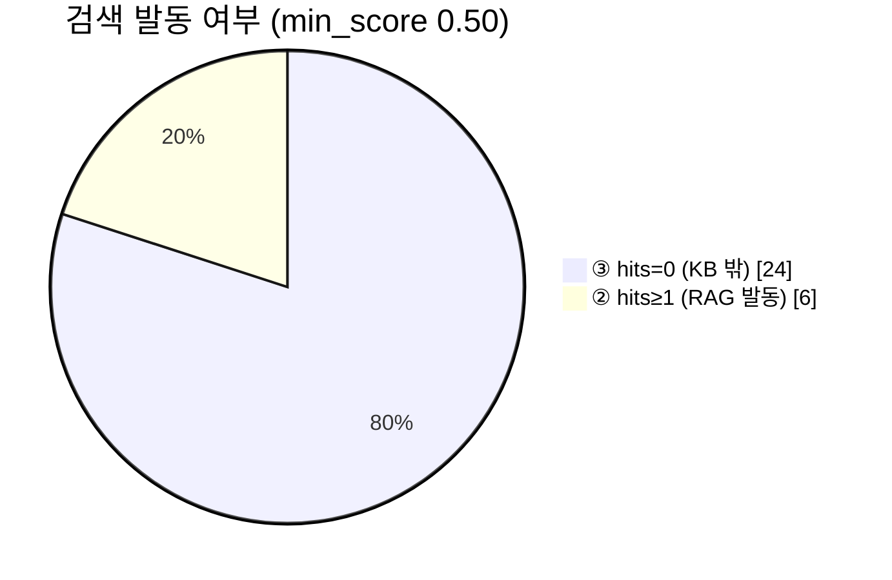
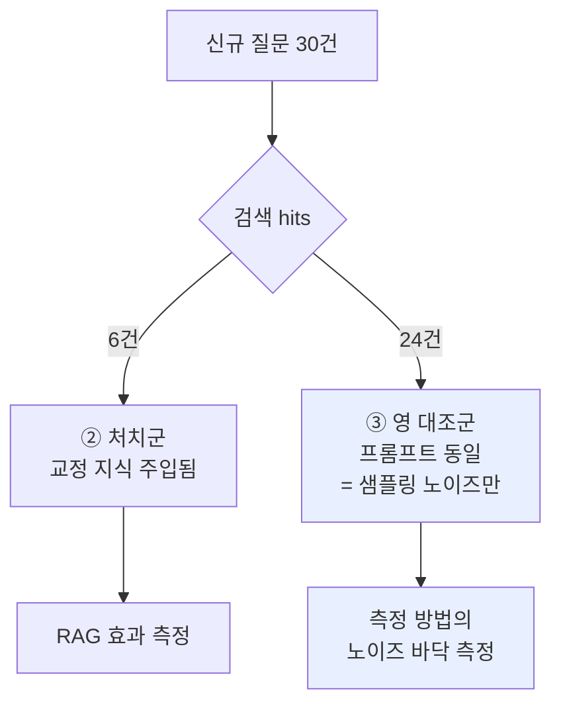
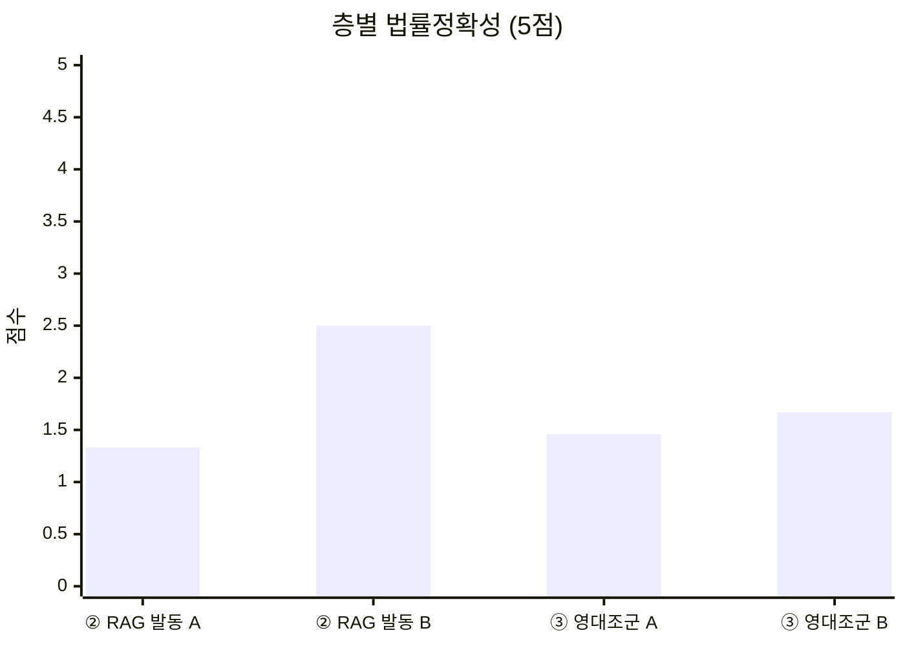
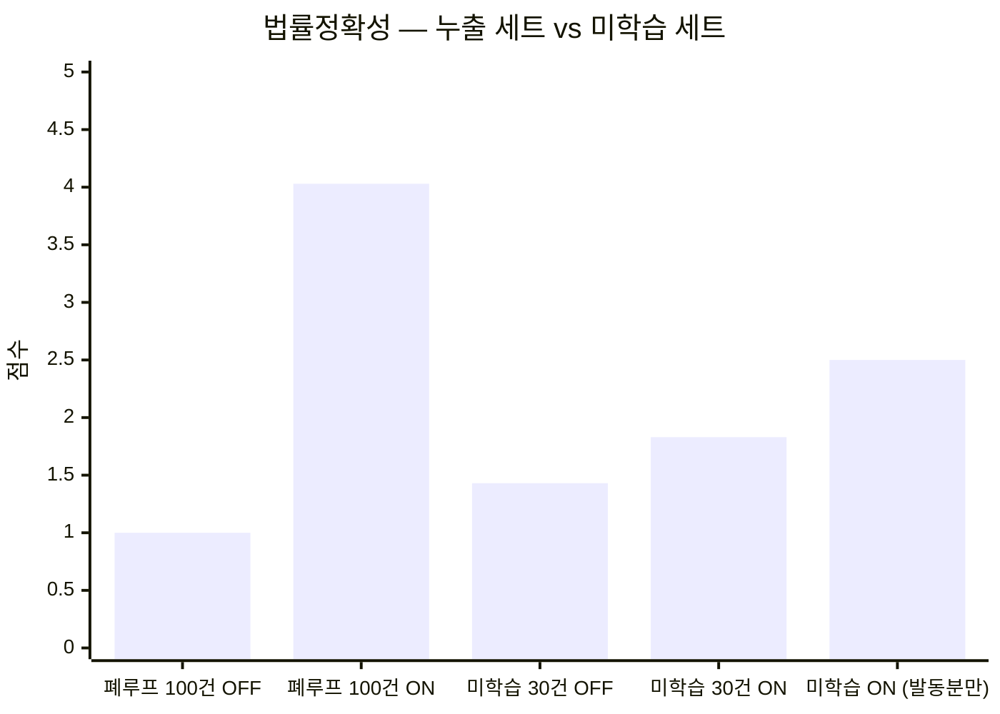
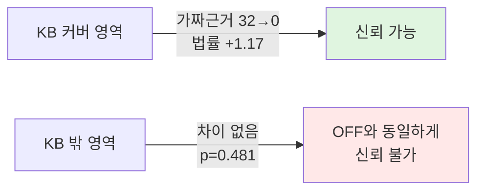

# 미학습 질문 30건 RAG ON/OFF — 영(null) 대조군이 앞선 리포트를 교정했다

작성일: 2026-07-19
대상: `upstage bulk test_답변.csv` (30문항, 신규 작성)
모델: Upstage `solar-pro3`, temperature 0.3 (양측 동일)
KB: `rag.passages` active 526건 (병의원 도메인)
선행: [260719_RAG_ONOFF_성능평가리포트_100건.md](260719_RAG_ONOFF_성능평가리포트_100건.md)

---

## 0. 요약 — 세 줄

1. **누출을 제거하니 RAG 효과가 +3.03점 → +0.40점으로 줄었다.** 앞 리포트의 수치는 대부분 질문 누출이 만든 것이었다.
2. **RAG가 실제로 발동한 6건에서는 가짜 근거가 32건 → 0건**으로 사라졌다. 효과 자체는 실재한다.
3. **앞 리포트 §5의 "검색 실패 시 RAG가 더 위험하다"는 주장은 철회한다.** n=1로 내린 결론이었고, n=24 영 대조군에서 p=0.481로 유의한 차이가 없다.

---

## 1. 질문 세트와 누출 검사

사용자가 신규 30문항을 작성했다. 내용은 **일반 법인세·소득세·부가세 논점**(특수관계인, 감가상각, 이월결손금, 금융소득 종합과세, 외국납부세액공제 등)이다.

**누출 검사 — 통과 ✅**

| 검사 | 방법 | 결과 |
|---|---|---|
| 문자열 누출 | 질문을 14자 조각으로 잘라 KB 원문 346,311자 전체 대조 | **0 / 30** |
| 의미 검색 | `embedding-query` → `match_passages` top-5, 컷 0.50 | top score 중앙 **0.445** |

앞 100건 실험은 98/100이 KB에 문자열 그대로 있었다. 이번은 0/30이다.

### 1-1. 뜻밖의 층 구성 — 그리고 그게 준 선물



KB는 병의원 도메인인데 질문은 일반 세무라 **24건이 검색 미발동**이다. 애초 의도한 ②20/③10과 정반대다.

그런데 여기서 결정적인 사실이 나온다. `bulk_ask_rag.build_user_prompt()`는:

```python
if not passages:
    return question          # ← RAG OFF 와 문자 그대로 동일한 프롬프트
```

즉 **hits=0인 24건은 두 열의 프롬프트가 완전히 같다.** 차이는 temperature 0.3의 샘플링뿐이다. 의도치 않게 **영(null) 대조군 n=24**를 얻었다.



이 대조군이 없었다면 이번 결과도 앞 리포트처럼 과대해석했을 것이다.

---

## 2. 채점 설계 — 맹검

- 열 이름을 **A / B**로만 제시하고 어느 쪽이 RAG인지 알리지 않았다
- **층 정보(hits 수)도 숨겼다**
- 4개 배치에 ②③을 인터리브 분배해 한 채점자가 한 층에 몰리지 않게 했다
- 지시문에 명시: *"두 답변이 거의 같아 보이면 동률로 판정하는 것이 정답이다. 억지로 우열을 가리지 마라"*
- A=OFF, B=ON 위치는 고정 — **위치 편향이 있다면 ③층에서 B 편중으로 드러나도록** 일부러 고정했다

---

## 3. 결과

### 3-1. 층별 분리

| | ② RAG 발동 (n=6) | ③ 영 대조군 (n=24) | 전체 (n=30) |
|---|---:|---:|---:|
| A(OFF) 문장력 | 3.00 | 3.00 | 3.00 |
| B(ON) 문장력 | 3.17 | 3.08 | 3.10 |
| **Δ 문장력** | **+0.17** | +0.08 | +0.10 |
| A(OFF) 법률정확성 | 1.33 | 1.46 | 1.43 |
| B(ON) 법률정확성 | 2.50 | 1.67 | 1.83 |
| **Δ 법률정확성** | **+1.17** | **+0.21** | +0.40 |
| 판정 B / A / 동률 | 5 / 1 / 0 | 11 / 7 / 6 | 16 / 8 / 6 |
| **가짜 근거 인용** | **32 → 0** | 124 → 134 | 156 → 134 |

### 3-2. 영 대조군이 말하는 것 — 측정 방법 검증



③층 판정: **B 11 vs A 7 (동률 6), 이항검정 양측 p = 0.481.**

> **유의한 차이 없음.** 프롬프트가 동일하니 당연히 그래야 하고, 실제로 그렇게 나왔다.
> → **채점자의 위치 편향은 검출되지 않았다. 채점 방법이 작동한다.**

가짜 근거도 124 vs 134로 사실상 동일하다. Δ법률 +0.21은 이 노이즈 안에 있다.

### 3-3. 처치군 — 효과는 실재하나 표본이 작다

②층 6건에서 가짜 근거가 **32건 → 0건**, 보유 답변이 **5/6 → 0/6**이다. 답변 길이도 급감했다(5,012→846자, 3,343→346자).

| no | 질문 요지 | A(OFF) 가짜근거 | B(ON) 가짜근거 |
|---:|---|---:|---:|
| 5 | 대표 가지급금 인정이자·업무무관 이자 | 9 | 0 |
| 8 | 업무무관 부동산 취득세·업무용승용차 상각 | 10 | 0 |
| 13 | 접대비 적격증빙·한도 | 6 | 0 |
| 24 | 기타소득 의제필요경비율 | 4 | 0 |
| 25 | 5월 종합소득세 합산 대상 | 0 | 0 |
| 30 | 부가세 단일세율·수입 과세 | 3 | 0 |

> ⚠️ **다만 판정 5:1은 n=6에서 이항검정 p=0.219로 통계적 유의성에 못 미친다.** 점수 차이는 방향만 신뢰하고, 크기는 신뢰하지 말 것. **가짜 근거 32→0은 점수가 아니라 실물 카운트**라 이쪽이 훨씬 단단하다.

---

## 4. 누출이 부풀린 크기 — 앞 리포트 보정



| | 폐루프 100건 (98% 누출) | 미학습 30건 (누출 0) |
|---|---:|---:|
| RAG OFF 법률정확성 | 1.00 | 1.43 |
| RAG ON 법률정확성 | **4.03** | **1.83** |
| RAG ON (발동분만) | — | 2.50 |
| **Δ** | **+3.03** | **+0.40** |

**앞 리포트의 +3.03 중 실제 RAG 몫은 작다.** 대부분은 "정답지를 검색해 온" 효과였다.

### 4-1. 철회하는 주장

앞 리포트 §5는 no.1(hits=0에서 ON이 OFF보다 나빴던 유일 건)을 근거로 이렇게 썼다:

> ~~"RAG는 검색이 실패한 자리에서 RAG OFF보다 안전하지 않다. '근거가 있다'는 프롬프트 틀만 남고 내용이 비어 환각을 부른다."~~

**이 주장을 철회한다.** 두 가지 이유다.

1. **코드가 그렇지 않다.** hits=0이면 주입 문구 자체가 붙지 않는다(`return question`). "틀만 남는다"는 서술은 코드를 잘못 읽은 것이다.
2. **데이터가 그렇지 않다.** n=24 영 대조군에서 A 7 / B 11 / 동률 6, p=0.481. no.1은 샘플링 변동 1건이었다.

앞 리포트 §6 표의 "③ 필수 — no.1 실패 모드" 서술과, §8 P1 항목 "hits=0 분기 — 주입 틀 제거"도 근거를 잃었다. **hits=0 분기는 이미 올바르게 구현되어 있다.**

---

## 5. 더 중요한 발견 — 절대 수준이 낮다

층을 나누기 전에 봐야 할 숫자가 있다.

> **미학습 질문에서 RAG ON의 법률정확성은 1.83 / 5, 발동분만 봐도 2.50 / 5다.**

| 패턴 | A(OFF) | B(ON) |
|---|---:|---:|
| P5 가짜·오인용 조문판례 | 26 | 21 |
| P7 한도·특례 방향 오류 | 16 | 14 |
| P8 성급한 단정 | 10 | 4 |
| P9 산술 오류 | 8 | 6 |
| P12 자기모순 | 7 | 6 |
| P2 템플릿 환각 | 4 | 9 |

**P5가 양쪽 모두 높다.** 처음 보는 질문에서는 RAG가 있든 없든 조문·판례를 지어낸다. 채점자들이 반복 지적한 공통 오답:

- `대법원 2018다12345`, `2015다12345`, `2020다2001` — 자리표시자 일련번호
- 상습 오인용: 소득세법 §12(실제는 비과세소득), 법인세법 §22(실제는 자산평가손실), 각종 시행령 §12
- 양쪽 다 놓친 논점: 특수관계인 기부 시 Max(시가, 장부가) — 법인령 §36① / 전환사채 양도차익 비과세 / 선세금 월수 안분 — 소득령 §51③

**즉 KB 커버리지 밖에서 이 제품의 법적 신뢰도는 아직 낮다.** RAG는 커버된 영역을 고치지, 모델의 기본 법률 지식을 고치지 않는다.

---

## 6. 이번 실험으로 갱신된 제품 논지

기존 메모(`project_rag_product_thesis`)의 *"RAG는 답변 품질이 아니라 답할 수 있는 범위를 넓힌다"* 가 **데이터로 확인됐다.**



- RAG는 **커버된 곳에서만** 작동한다 — 그 안에서는 가짜 근거를 0으로 만든다
- KB 밖에서는 **해도 안 하느니만 못하지도, 낫지도 않다** (중립)
- 따라서 **커버리지 비율 자체가 핵심 지표**다. 이번 세트는 6/30 = 20%였다

본선에서 쓸 문장:
> "세무사 교정이 들어간 영역에서 가짜 근거 인용이 사라진다(32건 → 0건). KB가 자랄수록 그 영역이 넓어진다."

쓰면 안 되는 문장:
> ~~"RAG로 법률정확성이 1.00에서 4.03으로 올랐다"~~ — 누출 세트 수치다.

---

## 7. 남은 것

| 우선순위 | 항목 | 근거 |
|---|---|---|
| **P0** | `llm.py` `write_segments`/`write_advisory`에 `reshape_passage()` 이식 | 앞 리포트 §7-2 — 여전히 유효 |
| **P0** | **병의원 도메인** 미학습 질문 세트 재작성 (②를 20건 이상 확보) | 이번 세트는 ②가 6건뿐이라 처치군이 저출력 |
| P1 | ②층 표본 확대 후 재측정 — n=6은 p=0.219로 부족 | §3-3 |
| P1 | 조문 인용 억제 완화 (✓ 블록의 조문은 인용 허용) | 발동 시 답변이 346~846자로 과도하게 짧아짐 |
| P2 | ~~hits=0 분기 추가~~ **불필요 — 이미 구현되어 있음** | §4-1 |

---

## 8. 배운 것

1. **영 대조군 없이는 A/B를 믿을 수 없다.** 이번엔 우연히 얻었지만, 다음부터는 **설계에 넣어야 한다** — 같은 프롬프트를 두 번 굴려 노이즈 바닥을 먼저 재고 시작할 것.
2. **n=1에서 인과를 읽지 말 것.** 앞 리포트의 no.1 해석이 그 실수였다. 그럴듯한 메커니즘 설명("틀만 남아 환각을 부른다")이 붙으면 더 위험하다 — 코드를 확인했으면 바로 틀린 걸 알았다.
3. **누출은 효과 크기를 7배 이상 부풀렸다** (+3.03 → +0.40). 사후에 caveat을 다는 것보다 **세트를 처음부터 나누는 게** 맞다.
4. **점수보다 카운트를 믿을 것.** 가짜 근거 32→0은 재현 가능하고 위치 편향에 강하지만, 5점 척도 평균은 그렇지 않다.
5. **좋은 실험은 자기 앞 실험을 깎는다.** 이번 결과는 앞 리포트의 핵심 수치를 축소하고 §5 주장 하나를 철회시켰다. 그게 실험이 제대로 작동했다는 증거다.
