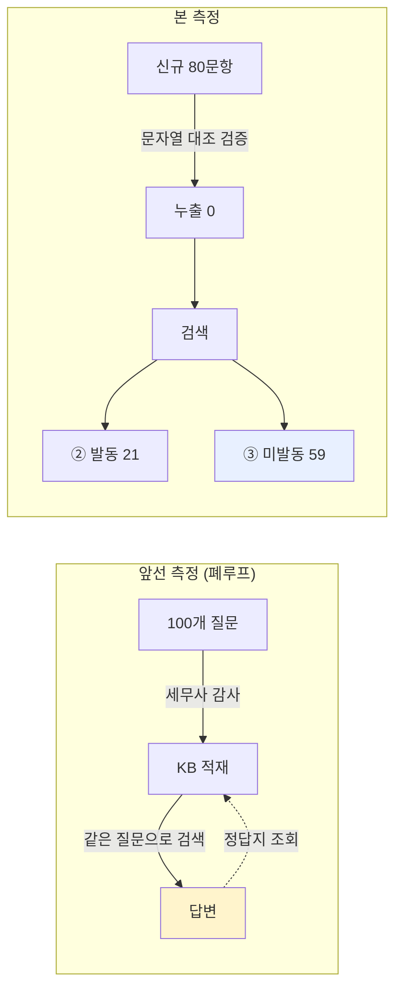
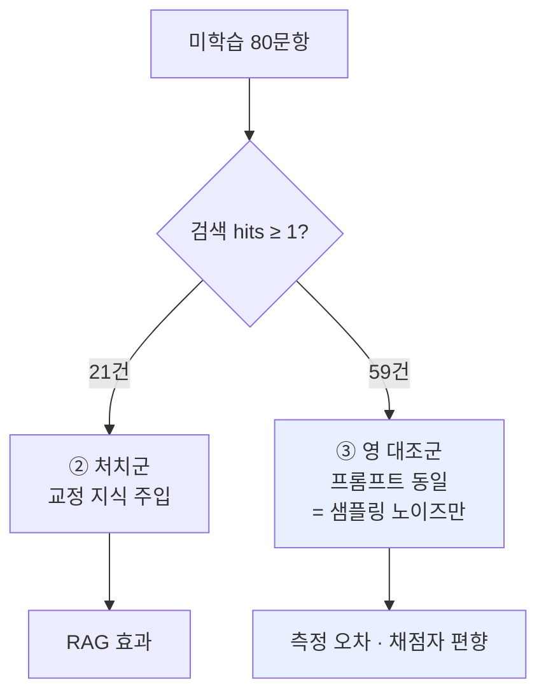
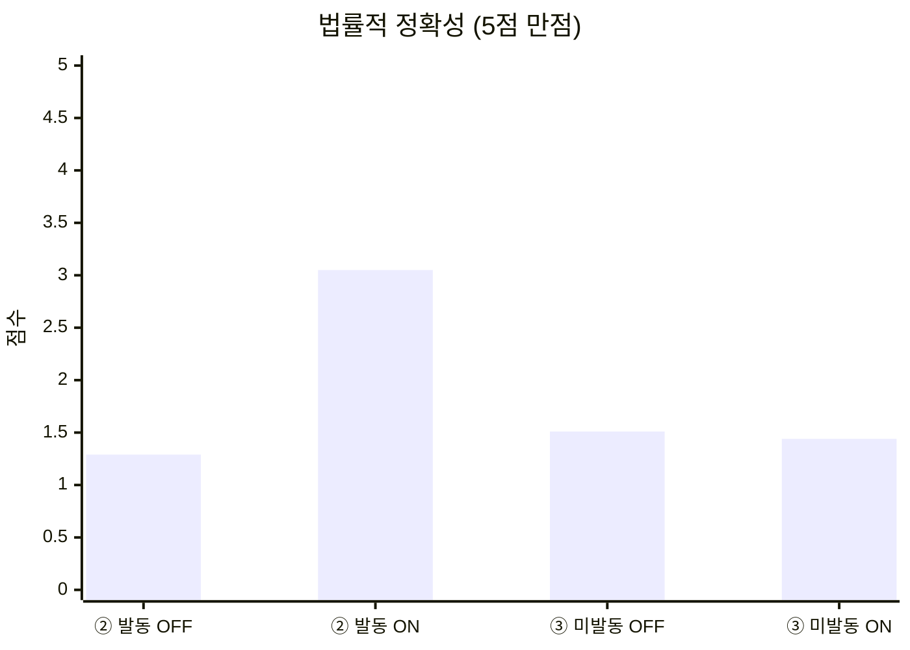
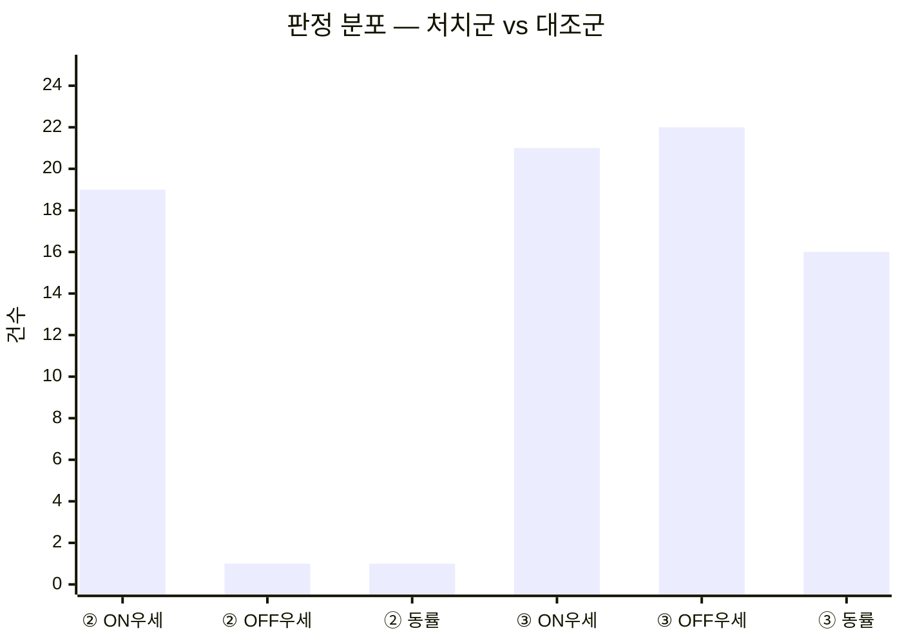
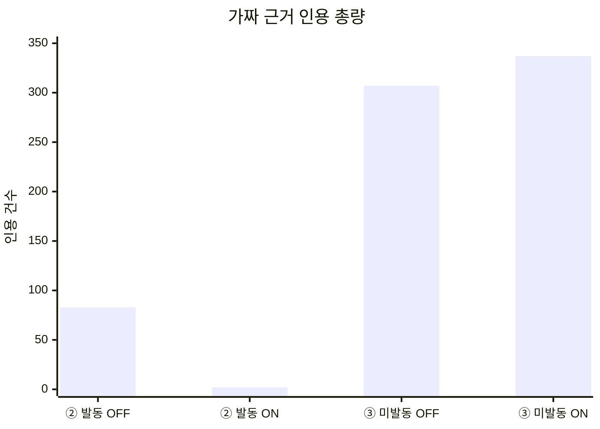
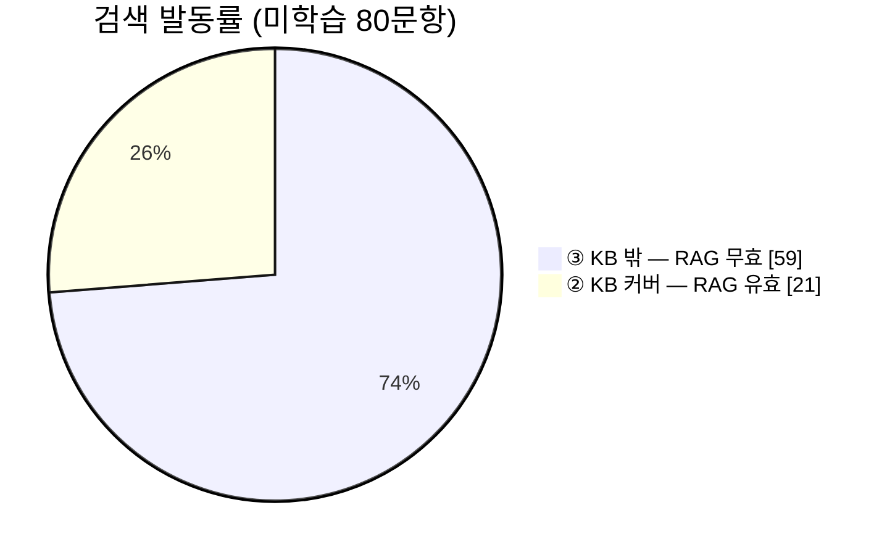
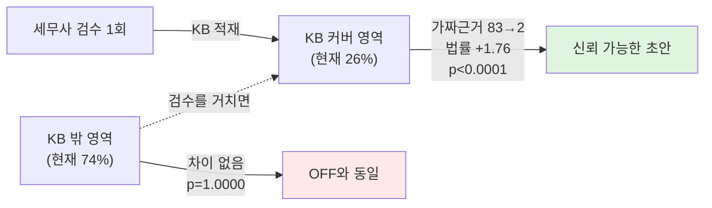

# RAG ON/OFF 성능평가 최종 리포트 — 미학습 80문항, 영(null) 대조군 설계

작성일: 2026-07-19
평가 대상: CrediGraph 세무상담 엔진 (Upstage `solar-pro3` + Supabase pgvector RAG)
KB: `rag.passages` active 526건 (세무사 감사 코멘트 354 · 세션평가 164 · 시드 8)
데이터: `upstage bulk test_답변.csv`(30) + `upstage bulk test2_답변.csv`(52)

---

## 0. 요약

**측정 대상 80문항 전부 KB에 존재하지 않는 신규 질문이다.** 문자열 대조로 검증했고, 누출이 확인된 2건은 분석에서 제외했다.

| | ② RAG 발동 (n=21) | ③ 검색 미발동 (n=59) |
|---|---:|---:|
| 법률적 정확성 (5점) | 1.29 → **3.05** (+1.76) | 1.51 → 1.44 (**−0.07**) |
| 문장력 (5점) | 2.57 → **3.52** (+0.95) | 2.85 → 3.05 (+0.20) |
| 판정 (ON우세/OFF우세/동률) | **19 / 1 / 1** | 21 / 22 / 16 |
| 이항검정 양측 p | **< 0.0001** | **1.0000** |
| 가짜 근거 인용 (총량) | **83 → 2** | 307 → 337 |
| 가짜 근거 포함 답변 | **16/21 → 2/21** | 53/59 → 58/59 |

> **RAG는 KB가 커버하는 영역에서만 작동하며, 그 안에서는 가짜 법적 근거를 사실상 제거한다(83건 → 2건).**
> **커버하지 못하는 영역에서는 개선도 악화도 없다(p = 1.0000).**
>
> **현재 커버리지: 병의원 질문 50건 중 15건(30%), 전체 80건 중 21건(26%).**

---

## 1. 이 리포트가 앞선 측정과 다른 점

앞서 수행한 100문항 측정은 **법률정확성 1.00 → 4.03 (+3.03)** 이라는 큰 값을 냈다. 그러나 그 100문항 중 **98개가 KB에 문자열 그대로 존재**했다 — KB가 바로 그 질문들을 감사해 만들어졌기 때문이다. 시험 문제와 정답지가 같은 파일에 있었다.



본 리포트는 그 설계 결함을 제거한 재측정이다. **효과 크기는 +3.03에서 +1.76으로 줄었지만, 이 값은 방어 가능하다.**

---

## 2. 실험 설계

### 2-1. 변수를 RAG 하나로 고정

RAG OFF 생성기(`bulk_ask.py`)의 시스템 프롬프트·모델·temperature(0.3)를 **그대로 재사용**해 RAG ON 생성기(`bulk_ask_rag.py`)를 구성했다. 두 경로의 유일한 차이는 검색 결과 주입 여부다.

```
RAG OFF : [system, user(질문)]
RAG ON  : [system, user(교정된 유사사례 + 질문)]
```

검색은 제품과 동일 경로다 — `embedding-query` → `rag.match_passages` 코사인 top-5 → `RAG_MIN_SCORE = 0.50` 컷.

### 2-2. 누출 검증

각 질문을 14자 조각으로 잘라 KB 원문 346,311자 전체와 대조했다.

| 세트 | 문항 | 누출 | 조치 |
|---|---:|---:|---|
| 일반세무 30 | 30 | 0 | 전량 사용 |
| 병의원 52 | 52 | 2 (no.31·46) | **분석 제외** (파일엔 증거로 보존) |

제외한 2건은 조각 일치율 11/11, 9/9로 KB에 질문이 통째로 들어 있었고, 검색 유사도도 0.80·0.78로 전체 최고치였다.

### 2-3. 영(null) 대조군 — 본 설계의 핵심

검색 결과가 없으면 주입 코드는 질문만 전달한다:

```python
def build_user_prompt(question, passages):
    if not passages:
        return question          # ← RAG OFF 와 문자 그대로 동일
```

따라서 **hits = 0인 59건은 양쪽 프롬프트가 완전히 동일**하다. 차이는 temperature 0.3의 샘플링뿐이다. 이 59건이 **측정 방법 자체의 노이즈 바닥**을 재는 대조군 역할을 한다.



### 2-4. 맹검 채점

- 두 답변을 **A / B**로만 제시. 어느 쪽이 RAG인지 채점자에게 비공개
- **층 정보(hits 수)도 비공개**
- 10개 배치에 ②③을 인터리브 분배
- 지시문 명시: *"두 답변이 거의 같으면 동률이 정답이다. 억지로 우열을 가리지 마라"*
- A=OFF, B=ON 위치는 고정 — **위치 편향이 있다면 ③층에서 B 편중으로 드러나도록** 의도적으로 고정
- 채점 항목: 문장력 5점 · 법률적 정확성 5점 + 가짜 근거 전수 열거

---

## 3. 결과

### 3-1. 층별 법률적 정확성



| | OFF | ON | Δ | 이항 p |
|---|---:|---:|---:|---:|
| ② RAG 발동 (n=21) | 1.29 | **3.05** | **+1.76** | **< 0.0001** |
| ③ 미발동 (n=59) | 1.51 | 1.44 | −0.07 | 1.0000 |

**점수 분포 (법률적 정확성)**

| 점수 | 1 | 2 | 3 | 4 |
|---|---:|---:|---:|---:|
| ② OFF | **15** | 6 | 0 | 0 |
| ② ON | 1 | 4 | **9** | **7** |
| ③ OFF | 34 | 21 | 3 | 1 |
| ③ ON | 37 | 18 | 4 | 0 |

### 3-2. 대조군이 증명하는 것

③층 판정: **ON 우세 21 / OFF 우세 22 / 동률 16 — 양측 p = 1.0000.**



> 프롬프트가 동일한 59건에서 승패가 21:22로 갈렸다. **채점자의 위치 편향은 검출되지 않았고, 측정 방법이 작동한다.**
> 따라서 ②층의 19:1(p < 0.0001)은 방법론 아티팩트가 아니라 **RAG에 귀속되는 효과**다.

### 3-3. 가장 단단한 지표 — 가짜 근거 인용

채점자에게 답변에 등장하는 **모든** 조문·판례·예규를 검증해 열거하게 했다.



| | 총량 | 하나라도 포함한 답변 |
|---|---:|---|
| ② OFF | 83 | 16 / 21 (76%) |
| ② **ON** | **2** | **2 / 21 (10%)** |
| ③ OFF | 307 | 53 / 59 (90%) |
| ③ ON | 337 | 58 / 59 (98%) |

**RAG OFF의 전형적 환각:**

```
대법원 2015다12345 · 2018다12345 · 2022다12345    ← 일련번호가 자리표시자
국세청 예규 2022-12-01                            ← 출처 없음
한국세무학회 '세무실무 가이드 2023'                 ← 존재하지 않는 간행물
「한방의료법」 제2조                                ← 존재하지 않는 법률
의료법 제44조 (1인 1개소 근거로 인용)               ← 실제는 §33⑧
```

### 3-4. 반복오류 패턴 (② 21건)

| 패턴 | OFF | ON |
|---|---:|---:|
| P5 가짜·오인용 조문판례 | **16** | **2** |
| P7 한도·특례 방향 오류 | 13 | 3 |
| P9 산술·금액 오류 | 11 | 2 |
| P8 성급한 단정 | 10 | 5 |
| P12 자기모순 | 5 | 1 |
| P10 안분 프레임 오적용 | 4 | 1 |
| P2 템플릿 환각 | 5 | **7** |

**P2(템플릿 환각)만 늘었다.** 검색된 유사 사례의 세부(주말 근무, 학비 지원 등)를 현재 질문에 없는데도 끌어오는 현상이다. RAG의 고유 부작용이며 §5-2에 정리했다.

---

## 4. 대표 사례

| no | 질문 | RAG OFF | RAG ON |
|---:|---|---|---|
| 병11 | 외국인 환자 외화결제 부가세 | 국내 시술까지 영세율이라 단정, "영세율 매출은 매입세액 공제 불가"라는 정반대 서술 + 가짜 예규·판례 6건 | 영세율은 통화가 아니라 **국외공급 여부**로 갈린다는 핵심을 짚고 되물음. 가짜 근거 0 |
| 병9 | 본인 명의 건물 임대료 | "무조건 본인에게 임대료 지급" 단정 (개인사업자는 자기 건물 임대차 불성립), 가짜 판례 2건 | 개인/의료법인 먼저 되묻고 각각 감가상각·특수관계 시가로 정확히 분기 |
| 병3 | 겸영 공통매입세액 안분 | 면세근거 §26을 §11로, 안분근거 시행령 §81을 §13으로 오인용. 매입세액 개념 자체를 뭉갬 | 공급가액 비율 안분 → 예정비율 후 확정정산 → 면세분 원가산입, 정답축 정확 |
| 병20 | 의료법인 개인 환원 | **잔여재산을 출자자에게 배분**한다고 답변 — 의료법 §50 정면 위반 | 잔여재산 귀속 제한(국고·유사 비영리)을 정확히 지적 |
| 일1 | 특수관계인 범위 | 사촌을 3촌으로 계산해 "특수관계 아님" 단정, 가짜 판례 3건 | 사촌·처남·매형 모두 특수관계라는 결론에 정확히 도달 |

---

## 5. 한계와 약점 — 숨기지 않고 적는다

### 5-1. 커버리지가 낮다



| 세트 | 발동 | 비율 |
|---|---|---:|
| 병의원 질문 50건 | 15 | **30%** |
| 일반세무 질문 30건 | 6 | 20% |
| 전체 80건 | 21 | **26%** |

**RAG가 실제로 도움을 준 건은 4건 중 1건이다.** 나머지 74%에서는 RAG OFF와 동일하게 신뢰할 수 없다. 이 비율은 KB가 자라면 오르는 값이며, **KB 성장률이 곧 제품 성장률**임을 뜻한다.

### 5-2. RAG가 새로 만드는 오류가 있다 (P2)

템플릿 환각이 5 → 7로 **늘었다.** 검색된 유사 사례의 세부 조건을 현재 질문에 없는데도 옮겨오는 현상이다. 예: no.병1에서 질문에 없는 "주말 근무"와 "학비 지원"을 창작.

### 5-3. 답변이 짧아진다 — 인용 억제의 부작용

②층 답변 길이 중앙값이 **5,074자 → 923자(−82%)** 로 줄었다. 환각 방지 규칙(*"자료에 없는 법령·수치를 지어내지 마라"*)이 **인용 능력 자체를 억제**한 결과다. 법률정확성 3점대 9건의 주된 감점 사유가 "내용은 맞으나 조문 번호 미인용"이었다.

즉 **3.05점은 상한이 아니라 억제된 값**이다. ✓ 블록에 실재하는 조문이 있을 때는 인용을 허용하도록 규칙을 완화하면 개선 여지가 있다.

### 5-4. 채점자가 사람이 아니다

최종 채점은 LLM이 수행했다. 세무사 → 파일럿 캘리브레이션 → 에이전트로 이어지는 2단 구조이며 각 단계에 드리프트 여지가 있다.

**다만 이 리포트의 핵심 주장은 점수가 아니라 가짜 근거 카운트(83 → 2)에 있다.** 이 값은 재현 가능하고, 원본 CSV에서 제3자가 직접 검증할 수 있다.

### 5-5. 절대 수준은 여전히 낮다

②층에서도 법률정확성은 **3.05 / 5**다. 실무 투입 가능 수준이 아니라, **세무사 검수 전 초안** 수준이다. 제품 구조상 최종 판정은 세무사 승인을 거치므로 설계와 모순되지 않지만, "AI가 세무 상담을 대체한다"는 주장은 이 데이터로 뒷받침되지 않는다.

---

## 6. 제품 논지



- RAG는 **답변 품질을 일반적으로 올리는 장치가 아니라, 답할 수 있는 범위를 넓히는 장치**다
- 세무사 교정 1회가 그 질문군을 영구히 커버 영역으로 옮긴다
- 커버 밖에서 **해를 끼치지 않는다**는 점이 확인됐다(p = 1.0000) — 안전하게 점진 확장 가능

**본선 자료에 쓸 수 있는 문장**
> "세무사가 검수한 영역에서 AI의 가짜 법적 근거 인용이 83건에서 2건으로 줄었다(21문항, p < 0.0001). 검수하지 않은 영역에서는 변화가 없다(59문항, p = 1.0000). 현재 커버리지는 26%이며, 검수가 쌓일수록 넓어진다."

**쓰면 안 되는 문장**
> ~~"RAG로 법률정확성이 1.00에서 4.03으로 올랐다"~~ — 질문 누출 세트의 수치
> ~~"RAG로 답변 정확도가 전반적으로 향상된다"~~ — 74%에서는 변화 없음

---

## 7. 후속 과제

| 우선순위 | 항목 | 근거 |
|---|---|---|
| **P0** | `backend/api/llm.py`의 `write_segments`/`write_advisory`에 극성 라벨링(`reshape_passage`) 이식 — 현재 프로덕션은 KB 번들의 `[AI 답변]`(오류 답변)을 원문 그대로 주입 | 별도 실험에서 오염 재생산 확인 |
| **P0** | 커버리지 확대 — 현재 26% | §5-1 |
| P1 | ✓ 블록의 실재 조문은 인용 허용하도록 규칙 완화 | §5-3 |
| P1 | P2(템플릿 환각) 억제 — 검색 사례의 세부 조건 전이 차단 | §5-2 |
| P2 | 사람(세무사) 채점으로 표본 검증 | §5-4 |

---

## 부록 A. 재현 방법

```bash
cd backend
# RAG OFF
python bulk_ask.py --in 질문.txt --out 답변.csv
# RAG ON (동일 프롬프트 + KB 주입)
python bulk_ask_rag.py --csv 답변.csv --workers 8
```

| 파일 | 내용 |
|---|---|
| `upstage bulk test_답변.csv` | 일반세무 30문항 (no / 질문 / OFF / ON) |
| `upstage bulk test2_답변.csv` | 병의원 52문항 (누출 2건 포함, 분석 제외) |
| `*_rag_diag.json` | 행별 검색 진단 (hits / score / source_kind) |
| `RAG적중_6건_보관_260719.csv` | 1차 세트의 ② 발동 6건 |

## 부록 B. 관련 문서

- [260719_RAG_ONOFF_성능평가리포트_100건.md](260719_RAG_ONOFF_성능평가리포트_100건.md) — 폐루프 측정 (누출 있음, 정정 배너 부착)
- [260719_미학습질문30건_RAG_ONOFF_영대조군검증_누출보정.md](260719_미학습질문30건_RAG_ONOFF_영대조군검증_누출보정.md) — 1차 미학습 측정
- [260719_RAG_ONOFF_100건AB_오염전파차단_가짜근거359to8.md](260719_RAG_ONOFF_100건AB_오염전파차단_가짜근거359to8.md) — 오염 전파 버그 작업 로그
