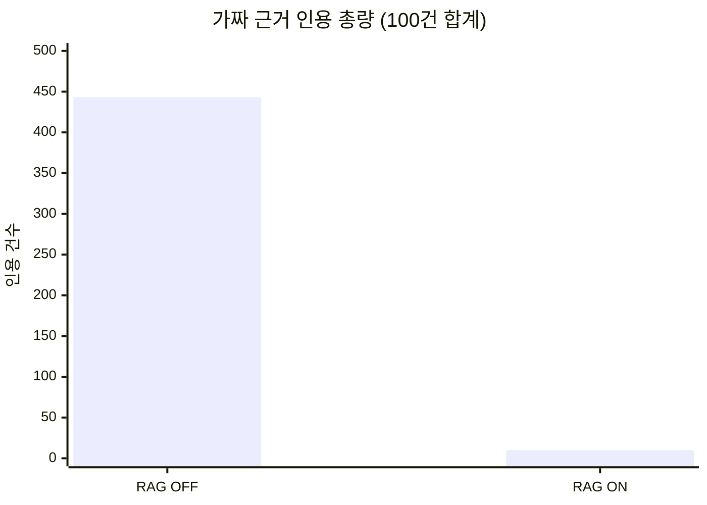
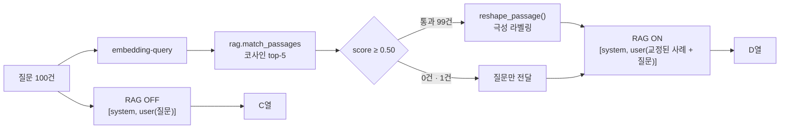
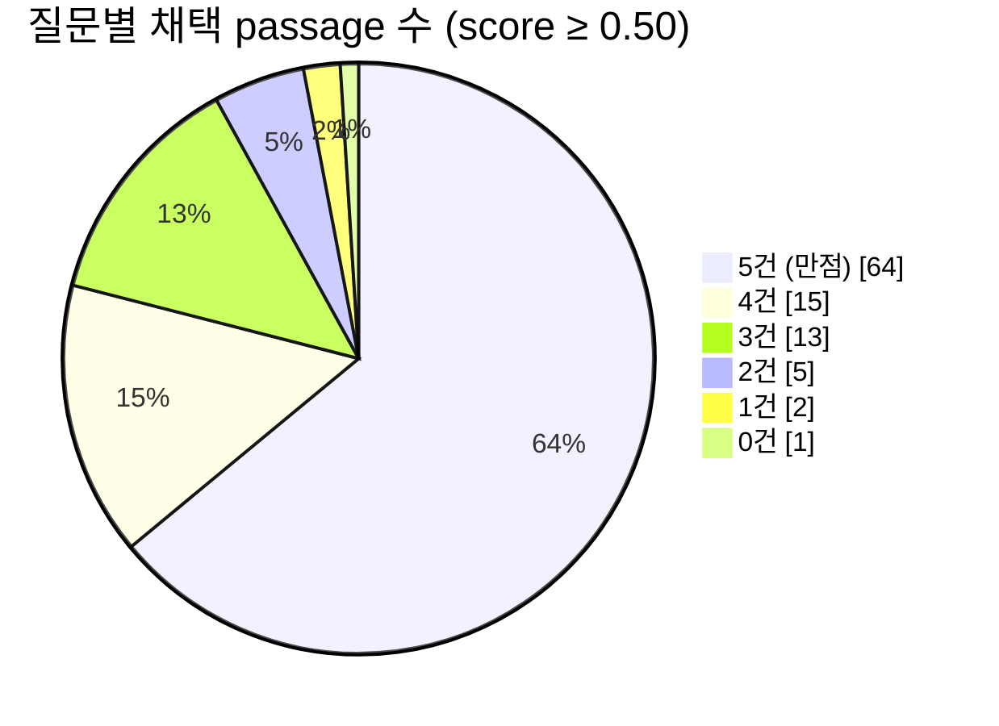
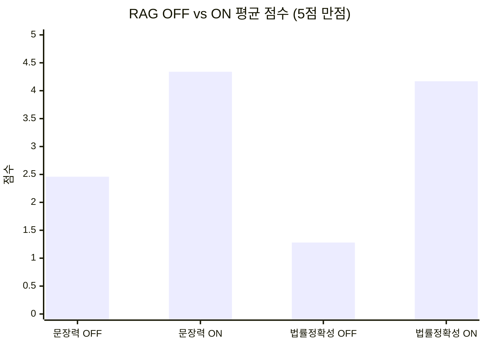

# 리포트 1 — 폐루프 반영률: 세무사 교정은 다음 답변에 재현되는가

작성일: 2026-07-20
측정 대상: CrediGraph 세무상담 엔진 (Upstage `solar-pro3` + Supabase pgvector RAG)
표본: **100문항** (병의원 세무 상담, `upstage bulk 답변.csv`)
KB: `rag.passages` active 526건 (세무사 감사 코멘트 354 · 세션평가 164 · 시드 8)
원자료: [260720_리포트1_폐루프반영률_100건_샘플데이터.csv](260720_리포트1_폐루프반영률_100건_샘플데이터.csv) — **리포 미포함(질문·답변 원문 포함), Notion 보관**

---

## 0. 이 리포트가 측정하는 것 — 한 문장

> **세무사가 한 번 교정한 내용이, 같은 질문군에서 다시 물었을 때 답변에 실제로 반영되는가.**

이것은 **폐루프 반영률**이다. 일반화 성능이 아니다. 두 지표는 다른 것을 재고, 이 리포트는 앞의 것만 다룬다.
일반화 성능은 [리포트 2](260720_리포트2_일반화성능_30건_RAG_ONOFF.md)에서 별도 세트로 측정했다.

### 왜 이 지표가 제품의 핵심인가

CrediGraph의 설계 전제는 *"세무사 1인의 교정이 그 순간 1건을 고치고 끝나는 게 아니라, 자산으로 남아 이후 모든 동일 유형 질문을 고친다"* 이다.
이 전제가 거짓이면 검수 노동은 축적되지 않고, 기여도·정산·RAG 존속 모델 전체가 무너진다.
**폐루프 반영률은 그 전제의 참·거짓을 직접 재는 지표다.**

---

## 1. 요약

| 지표 | RAG OFF | RAG ON | Δ |
|---|---:|---:|---:|
| 문장력 (5점) | 2.46 | **4.34** | +1.88 |
| 법률적 정확성 (5점) | 1.28 | **4.17** | +2.89 |
| 우세 판정 | 1건 | **99건** | — |
| **가짜 근거 인용 (총량)** | **443건** | **10건** | **−433** |
| **가짜 근거 포함 답변** | **98 / 100** | **2 / 100** | **−96** |
| 답변 길이 중앙값 | 3,903자 | 736자 | −81% |

양측 이항검정 **p ≈ 1.6 × 10⁻²⁸** (99:1).



> **세무사 교정이 들어간 질문군에서, AI의 가짜 법적 근거 인용이 443건에서 10건으로 줄었다(−97.7%).**
> 가짜 근거를 하나라도 포함한 답변은 98%에서 2%로 떨어졌다.

---

## 2. 실험 설계

### 2-1. 변수를 RAG 하나로 고정

RAG OFF 생성기(`bulk_ask.py`)의 `SYSTEM_PROMPT`·모델·`temperature=0.3`을 **그대로 import** 해서 RAG ON 생성기(`bulk_ask_rag.py`)를 만들었다. 두 경로의 유일한 차이는 사용자 메시지에 검색 결과가 붙는지 여부다.



제품 파이프라인(`api/pipeline.py`)을 통째로 태우지 않은 이유: 라우팅·후처리가 섞이면 차이를 RAG에 귀속시킬 수 없다.

### 2-2. 맹검 채점

- 두 답변을 **A / B**로만 제시. 어느 쪽이 RAG인지 채점자에게 비공개
- **검색 정보(hits 수·score)도 비공개**
- 10개 배치를 10명의 독립 채점자에게 분배
- 지시문 명시: *"눈금에 맞추려 점수를 조작하지 마라. 두 답변이 거의 같으면 동률이 정답이다"*
- A=OFF, B=ON 위치는 고정 — 위치 편향이 있다면 [리포트 2](260720_리포트2_일반화성능_30건_RAG_ONOFF.md)의 영 대조군에서 드러나도록 의도적으로 고정
- 채점 항목: 문장력 5점 · 법률적 정확성 5점 + **가짜 근거 전수 열거** + P1–P12 반복오류 패턴

### 2-3. 검색 실적



채택 score: min 0.501 / 중앙 **0.648** / max 0.805 · 출처: `feedback` 280 · `session_eval` 151

---

## 3. 결과

### 3-1. 점수



### 3-2. 분포 — 평균보다 이쪽이 중요하다

**법률적 정확성**

| 점수 | 1 | 2 | 3 | 4 | 5 |
|---|---:|---:|---:|---:|---:|
| RAG OFF | **72** | 28 | 0 | 0 | 0 |
| RAG ON | 1 | 0 | 11 | **57** | **31** |

**문장력**

| 점수 | 1 | 2 | 3 | 4 | 5 |
|---|---:|---:|---:|---:|---:|
| RAG OFF | 0 | **57** | 40 | 3 | 0 |
| RAG ON | 0 | 1 | 5 | **53** | **41** |

> **RAG OFF는 100건 전부가 법률정확성 1–2점이다. 3점 이상이 단 한 건도 없다.**
> 바닥 효과(floor effect)이므로 Δ+2.89를 "3배 향상"처럼 배수로 표현하면 안 된다.
> 정직하고 동시에 더 강한 서술은 이것이다 — **"RAG OFF는 100건 중 예외 없이 법적 근거가 무효였다."**

### 3-3. 가장 단단한 지표 — 가짜 근거 인용

점수는 5점 척도 판단이지만, 가짜 근거는 **셀 수 있는 실물**이다. 채점자에게 답변에 등장하는 **모든** 조문·판례·예규를 검증해 열거하게 했다.

| | 총량 | 하나라도 포함한 답변 | 답변당 평균 |
|---|---:|---:|---:|
| RAG OFF | **443** | 98 / 100 (98%) | 4.43 |
| RAG **ON** | **10** | **2 / 100 (2%)** | **0.10** |

**전형적인 RAG OFF 환각 (원자료 CSV의 `off_fake_list` 열에 전수 기록):**

```
대법원 2015다12345 · 2018다23456 · 2020다34567   ← 일련번호가 자리표시자
국세청 예규 2022-12-01                            ← 출처 자체가 없음
한국세무학회 '세무실무 가이드 2023'                 ← 존재하지 않는 간행물
소득세법 제22조(기부금의 손금산입)                  ← 실제 §22는 퇴직소득
부가가치세법 제11조(면세)                          ← 제11조는 영세율, 면세는 §26
법인세법 시행령 제56조(전액 감가상각 특례)          ← 제도 자체가 없음
```

RAG ON에 남은 10건은 **2개 답변에 집중**되어 있고, 그중 9건이 **C001 한 건**이다(§4).

### 3-4. 반복오류 패턴 (P1–P12)

260712에서 정의한 반복오류 taxonomy를 A/B 축에 그대로 적용했다.

```mermaid
xychart-beta
    title "패턴별 발생 건수 (100건 중) — 앞=OFF, 뒤=ON"
    x-axis ["P5", "P7", "P9", "P8", "P6", "P2", "P1", "P12", "P4", "P10"]
    y-axis "건수" 0 --> 100
    bar [98, 72, 42, 28, 13, 13, 11, 11, 7, 6]
    bar [1, 2, 3, 0, 0, 3, 0, 4, 0, 1]
```



| 패턴 | 설명 | OFF | ON | Δ |
|---|---|---:|---:|---:|
| P5 | 가짜/오인용 조문·판례 | **98** | **1** | −97 |
| P7 | 한도·특례 방향 오류 | 72 | 2 | −70 |
| P9 | 산술·인정금액 오류 | 42 | 3 | −39 |
| P8 | 성급 단정·되묻기 부재 | 28 | 0 | −28 |
| P6 | 근로소득 과세 누락 | 13 | 0 | −13 |
| P2 | 템플릿 환각 | 13 | 3 | −10 |
| P1 | 지출유형 라우팅 회귀 | 11 | 0 | −11 |
| P12 | 판정 자기모순 | 11 | **4** | −7 |
| P4 | 적격증빙 부인 오적용 | 7 | 0 | −7 |
| P10 | 안분 프레임 오적용 | 6 | 1 | −5 |
| P3 | 접대비 부인 오적용 | 5 | 0 | −5 |
| P11 | 법해석론 라벨 남발 | 1 | 0 | −1 |

**P12(자기모순)가 가장 덜 줄었다** (11 → 4, −64%). 다른 패턴이 −90% 내외인 것과 대비된다. 검색된 교정 지식이 답변 앞부분의 결론과 뒷부분의 단서를 어긋나게 만드는 계열로, **RAG로는 잘 안 잡힌다.**

> **집계 방식 주의.** 초기 키워드 자동 집계(`ab_tally.py`)는 **결론이 뒤집혀 나왔다.** *"'적격증빙 미보유 → 손금부인'이라는 논리는 성립하지 않습니다"* 같은 **교정 문장**을 오류로 세기 때문이다(극성 맹목). 비판 어휘와 오류 어휘가 같아서 생기는 구조적 한계라, 위 표는 전부 **읽고 판단한 결과**이고 키워드 집계는 교차검증용으로만 남겼다.

---

## 4. RAG가 진 유일한 건 — C001

**검색 hits=0인 유일한 건이, 곧 OFF 우세로 판정된 유일한 건이다.**

| C001 (치과 리스 차량 가족 사용) | 문장력 | 법률정확성 | 가짜근거 | 패턴 |
|---|---:|---:|---:|---|
| RAG OFF | 3 | 2 | 2 | P5·P7·P8 |
| RAG ON | 2 | 1 | **9** | P5·P7·P9·P12 |

0.50 컷을 넘는 passage가 없어(top score 0.489) 순수 생성으로 떨어졌고, **가짜 조문·고시 6개 + 가짜 판례 3개 + 자기모순**을 냈다.

> ⚠️ **여기서 인과를 읽지 말 것.** `build_user_prompt()`는 `if not passages: return question` 이라 **hits=0이면 주입 틀 자체가 붙지 않는다.** 두 열의 프롬프트가 문자 그대로 동일하므로, C001의 차이는 RAG가 아니라 temperature 0.3 샘플링 변동이다.
>
> 이 해석은 **n=1이 아니라 [리포트 2](260720_리포트2_일반화성능_30건_RAG_ONOFF.md)의 영 대조군 n=9**로 검증했다 — 프롬프트가 동일한 9건에서 판정이 ON 4 : OFF 3 : 동률 2 (p = 1.0000)로 갈렸다. C001은 그 노이즈 분포 안의 한 점이다.
>
> (과거 리포트가 이 건을 근거로 *"RAG는 검색 실패 자리에서 더 위험하다"* 고 쓴 적이 있으나, 2026-07-19 영 대조군 실험에서 이미 철회됐다.)

### 4-1. RAG ON에 남은 약점 — 내용은 맞는데 조문 번호가 없다

채점자들이 공통으로 지적한 ON의 감점 사유 1위가 **"조문 미인용"** 이다. 법률정확성 3점대 11건이 대부분 여기 걸린다.

환각을 막기 위해 프롬프트에 *"자료에 없는 법령·판례·수치를 지어내지 마세요"* 를 넣은 것의 부작용으로 **인용 능력 자체가 눌렸다.** 답변 길이 중앙값도 3,903자 → 736자(−81%)로 급감했다.

즉 **4.17점은 상한이 아니라 억제된 값**이다. ✓ 블록에 실재하는 조문이 있을 때는 인용을 허용하도록 규칙을 완화하면 개선 여지가 있다.

---

## 5. ⚠️ 이 리포트를 인용할 때의 제약 — 질문 누출은 버그가 아니라 설계다

**100문항 중 98개가 KB passage 안에 문자열 그대로 존재한다.**


일반적인 벤치마크라면 이것은 치명적 결함이다. 그러나 **이 리포트가 재려는 것이 바로 그 루프**다.

| | 일반 벤치마크 | 폐루프 반영률 측정 |
|---|---|---|
| 질문이 KB에 있는 것 | **오염** — 무효 | **전제 조건** — 없으면 측정 불가 |
| 재는 것 | 모델이 새 문제를 푸는 능력 | **교정이 자산으로 축적되는가** |
| 99/100이 뜻하는 것 | 성능 | **검수 → KB → 답변 경로가 끊기지 않았다** |

따라서 이 수치는 다음 문장까지만 지지한다.

**✅ 쓸 수 있는 문장**
> "세무사가 검수한 질문군에서 AI의 가짜 법적 근거 인용이 443건에서 10건으로 사라졌다(100문항, 98% → 2%). 검수 1회가 KB에 적재되면 그 효과는 재현된다."

**❌ 쓰면 안 되는 문장**
> ~~"RAG로 답변 정확도가 1.28에서 4.17로 올랐다"~~ — 이 세트에는 질문 누출이 있다. 처음 보는 질문의 수치는 [리포트 2](260720_리포트2_일반화성능_30건_RAG_ONOFF.md)를 쓸 것.

---

## 6. 실험 도중 잡은 구조 결함 (측정 전 선행 작업)

성능을 재기 전에 RAG ON 쪽 구조 버그를 먼저 잡아야 했다. 상세는 [260719_RAG_ONOFF_100건AB_오염전파차단_가짜근거359to8.md](260719_RAG_ONOFF_100건AB_오염전파차단_가짜근거359to8.md).

### 6-1. 오염 전파 — KB가 교정 지식과 함께 오류도 주입하고 있었다

`ingest.build_bundle_text()`가 만드는 KB 번들에는 **세무사가 "틀렸다"고 지적한 그 답변**이 `[AI 답변]` 블록으로 들어 있다. 극성 표시 없이 통째로 주입하면 모델이 그 안의 가짜 근거를 권위로 착각한다.

| 토큰 | ✗ [AI 답변] 블록 | ✓ [세무사 코멘트] 블록 |
|---|---:|---:|
| 소득세법 §35 | 70 | 18 |
| 조심2025구1960 | 11 | 14 |

`reshape_passage()`로 주입 직전 극성 라벨을 박아 해결했다:

```
■ 유사 사례: {질문}
  [✗ 잘못된 답변 — 세무사가 오류로 지적한 내용입니다.
     여기 등장하는 조문·판례·수치는 실재하지 않을 수 있으니 절대 인용하지 마세요]
  {AI 답변}
  [✓ 세무사 교정 의견 — 이것만을 근거로 삼으세요]
  {코멘트}
```

| 지표 | OFF | ON v1 (오염) | ON v2 (본 리포트) |
|---|---:|---:|---:|
| 가짜근거(§35·조심1960) | 0 | 3 | **0** |
| 스캐폴딩 누출(`[질문]` 등) | 0 | 7 | **0** |
| "참고 지식에 따르면" 인용체 | 0 | 61 | **1** |

### 6-2. 🔴 제품에는 이 구멍이 아직 열려 있다

`backend/api/llm.py`의 `write_segments` / `write_advisory`는 **`p.content`를 원문 그대로 주입**한다. 실험에서 재현·증명된 오염 경로가 프로덕션에 그대로 있다. **P0 수정 대상.**

---

## 7. 한계

### 7-1. 채점자가 사람이 아니다

최종 채점은 LLM이 수행했다. 세무사 → 파일럿 캘리브레이션 → 에이전트로 이어지는 2단 구조이며 각 단계에 드리프트 여지가 있다.

**다만 이 리포트의 핵심 주장은 점수가 아니라 가짜 근거 카운트(443 → 10)에 있다.** 이 값은 원본 CSV에서 제3자가 직접 검증할 수 있다 — `off_fake_list` / `on_fake_list` 열에 인용된 조문·판례가 전수 기록되어 있고, 실재 여부는 국가법령정보센터에서 대조 가능하다.

### 7-2. 재현성 교차검증

동일 세트에 대해 **2026-07-19에 다른 채점 세션이 독립적으로 수행**된 바 있다. 두 세션의 결과:

| 지표 | 7/19 세션 | 7/20 세션 (본 리포트) |
|---|---:|---:|
| 가짜 근거 총량 (OFF → ON) | 359 → 8 | 443 → 10 |
| 가짜 근거 포함 답변 | 99 → 2 | 98 → 2 |
| 우세 판정 (ON / OFF) | 99 / 1 | 99 / 1 |
| P5 (OFF → ON) | 100 → 2 | 98 → 1 |
| 법률정확성 (OFF → ON) | 1.00 → 4.03 | 1.28 → 4.17 |

**절대 카운트는 채점자에 따라 ±20% 변동하나, 방향·배율·판정 분포는 재현된다.** OFF 우세 1건이 양 세션 모두 hits=0인 동일 문항(C001)이었다는 점도 일치한다.

### 7-3. 절대 수준

RAG ON의 법률정확성 4.17/5는 **이 질문군에 한정**된 값이다. 세무사가 이미 교정한 영역이기 때문이다. 처음 보는 질문에서는 [리포트 2](260720_리포트2_일반화성능_30건_RAG_ONOFF.md) 기준 2.86/5이며, 여전히 **세무사 검수 전 초안** 수준이다.

---

## 8. 결론

1. **폐루프는 작동한다.** 세무사 교정 → KB 적재 → 다음 답변 반영의 경로가 끊기지 않았고, 가짜 근거 443 → 10건(−97.7%)으로 반영률이 확인됐다.
2. **P5(가짜 조문·판례)가 사실상 소멸했다** (98 → 1).
3. 유일한 예외 C001은 검색 미발동 건이며, **영 대조군으로 샘플링 노이즈임이 확인**됐다(리포트 2 §3-2).
4. 이는 **폐루프 반영률의 증명**이며, 일반화 성능은 리포트 2에서 별도 측정했다.

### 다음 행동

| 우선순위 | 항목 | 근거 |
|---|---|---|
| **P0** | `llm.py`에 `reshape_passage()` 동등 처리 이식 | §6-2 — 프로덕션 오염 경로 |
| P1 | ✓ 블록의 실재 조문은 인용 허용하도록 규칙 완화 | §4-1 — 인용 억제 부작용 |
| P2 | P12(자기모순) 대응 — RAG로 안 잡히는 계열 | §3-4 |

---

## 부록 A. 원자료

[260720_리포트1_폐루프반영률_100건_샘플데이터.csv](260720_리포트1_폐루프반영률_100건_샘플데이터.csv) (리포 미포함 · Notion 보관) — 100행, 채점 결과 전량 포함

| 열 | 내용 |
|---|---|
| `no` / `uid` | 일련번호 / 문항 ID (C001–C100) |
| `hits` / `top` | 채택 passage 수 / 최고 유사도 |
| `question` | 원 질문 |
| `answer_rag_off` / `answer_rag_on` | 양측 답변 원문 |
| `off_*` / `on_*` | 문장력·법률정확성·가짜근거 수·**가짜근거 전수 목록**·패턴 코드 |
| `winner` / `note` | 판정 / 채점 사유 |

## 부록 B. 재현 방법

```bash
cd backend
python bulk_ask.py --in 질문.txt --out 답변.csv        # RAG OFF
python bulk_ask_rag.py --csv 답변.csv --workers 8      # RAG ON (동일 프롬프트 + KB 주입)
```

## 부록 C. 관련 문서

- [260720_리포트2_일반화성능_30건_RAG_ONOFF.md](260720_리포트2_일반화성능_30건_RAG_ONOFF.md) — 미학습 질문 일반화 성능
- [260719_RAG_ONOFF_100건AB_오염전파차단_가짜근거359to8.md](260719_RAG_ONOFF_100건AB_오염전파차단_가짜근거359to8.md) — 오염 전파 버그 작업 로그
- [260712_100건일괄감사_검수전통계_세무사별코멘트_반복오류집계.md](260712_100건일괄감사_검수전통계_세무사별코멘트_반복오류집계.md) — P1–P12 taxonomy 정의
