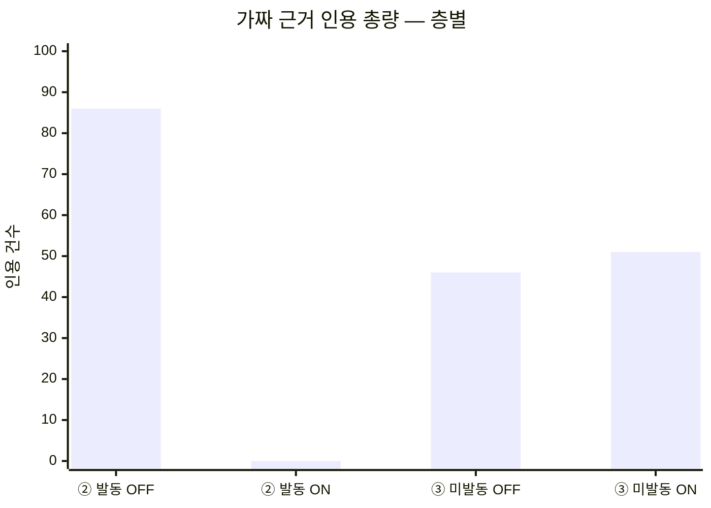
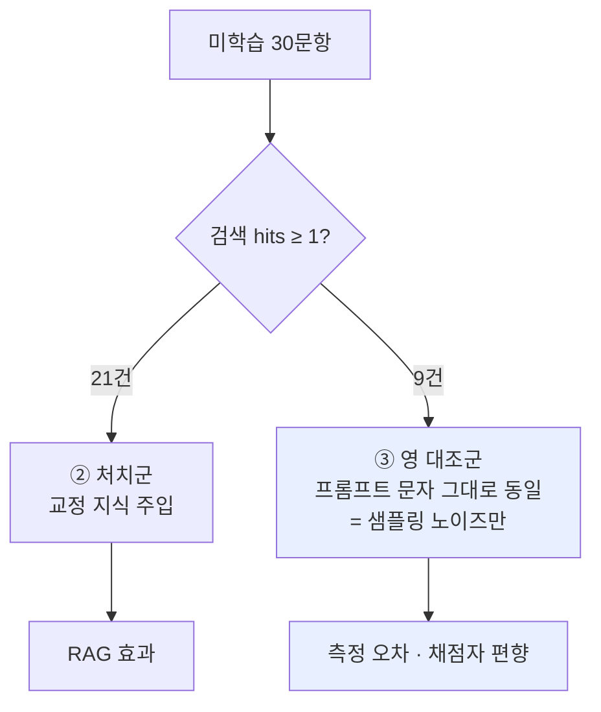
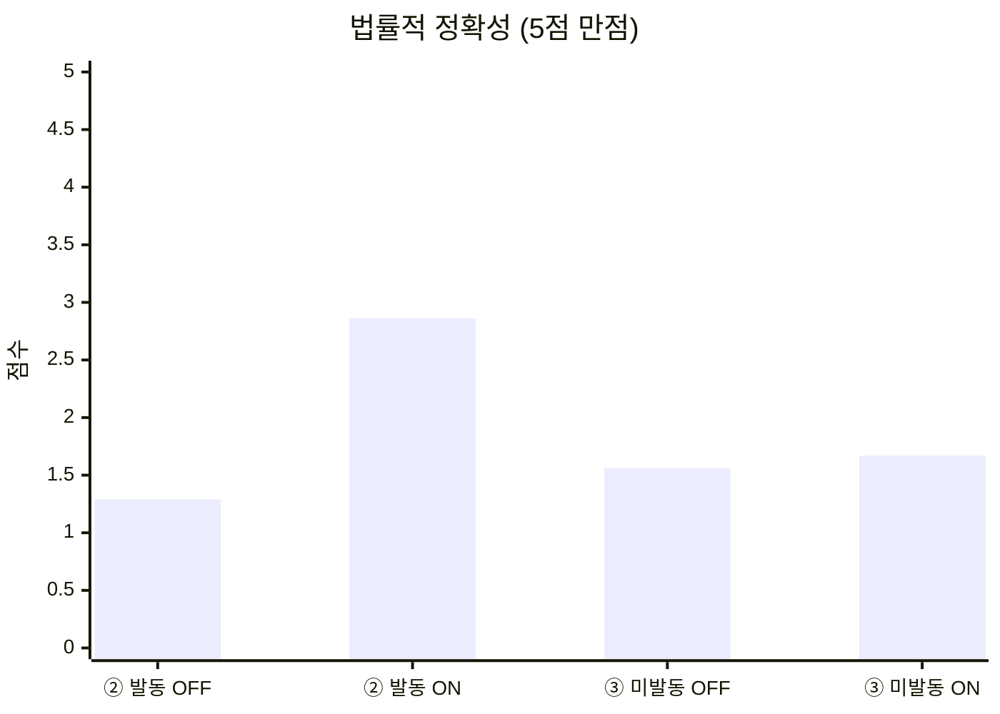
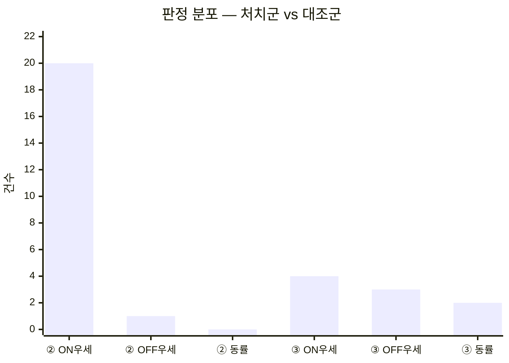
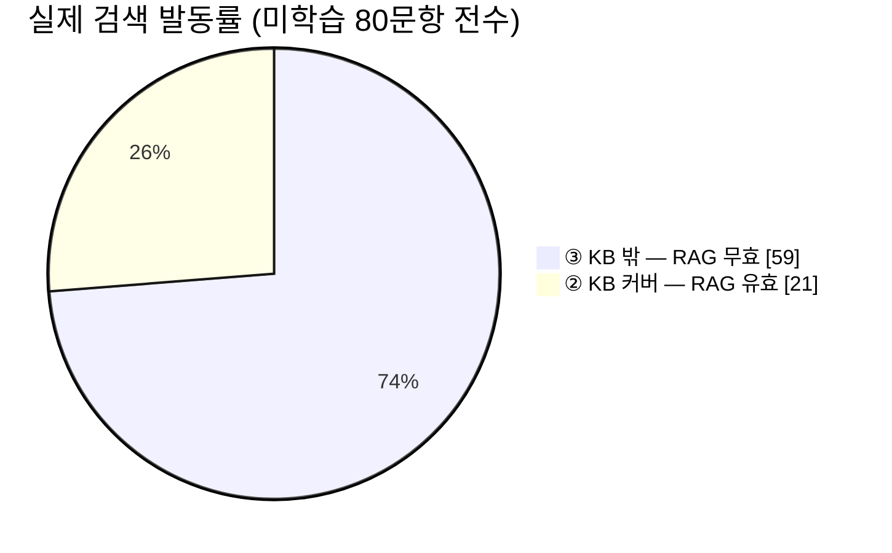
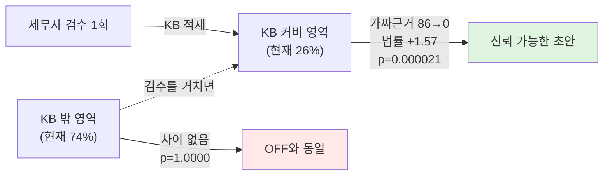

# 리포트 2 — 일반화 성능: 처음 보는 질문에서 RAG는 무엇을 바꾸는가

작성일: 2026-07-20
측정 대상: CrediGraph 세무상담 엔진 (Upstage `solar-pro3` + Supabase pgvector RAG)
표본: **미학습 30문항** (KB에 존재하지 않는 신규 질문)
KB: `rag.passages` active 526건 (세무사 감사 코멘트 354 · 세션평가 164 · 시드 8)
원자료: [260720_리포트2_일반화성능_30건_샘플데이터.csv](260720_리포트2_일반화성능_30건_샘플데이터.csv) — **리포 미포함(질문·답변 원문 포함), Notion 보관**

---

## 0. 이 리포트가 측정하는 것 — 한 문장

> **KB에 없던 질문을 처음 받았을 때, RAG가 답변을 실제로 바꾸는가.**

[리포트 1](260720_리포트1_폐루프반영률_100건_RAG_ONOFF.md)이 잰 것은 폐루프 반영률 — 세무사가 이미 교정한 질문군에서의 재현성이었다. 여기서는 **한 번도 검수된 적 없는 질문 30건**으로 측정한다.

---

## 1. 요약

**측정 결과는 층에 따라 정반대다. 평균 하나로 뭉치면 안 된다.**

| | ② RAG 발동 (n=21) | ③ 검색 미발동 (n=9) |
|---|---:|---:|
| 법률적 정확성 (5점) | 1.29 → **2.86** (+1.57) | 1.56 → 1.67 (+0.11) |
| 문장력 (5점) | 2.67 → **3.71** (+1.05) | 2.78 → 3.00 (+0.22) |
| 판정 (ON / OFF / 동률) | **20 / 1 / 0** | 4 / 3 / 2 |
| 이항검정 양측 p | **0.000021** | **1.0000** |
| **가짜 근거 인용 (총량)** | **86 → 0** | 46 → 51 |
| 가짜 근거 포함 답변 | **16/21 → 0/21** | 7/9 → 9/9 |



> **RAG는 KB가 커버하는 영역에서만 작동하며, 그 안에서는 가짜 법적 근거를 완전히 제거한다(86건 → 0건).**
> **커버하지 못하는 영역에서는 개선도 악화도 없다(p = 1.0000).**

---

## 2. 실험 설계

### 2-1. 변수를 RAG 하나로 고정

RAG OFF 생성기(`bulk_ask.py`)의 시스템 프롬프트·모델·`temperature=0.3`을 **그대로 재사용**해 RAG ON 생성기(`bulk_ask_rag.py`)를 구성했다. 두 경로의 유일한 차이는 검색 결과 주입 여부다.

```
RAG OFF : [system, user(질문)]
RAG ON  : [system, user(교정된 유사사례 + 질문)]
```

검색은 제품과 동일 경로다 — `embedding-query` → `rag.match_passages` 코사인 top-5 → `RAG_MIN_SCORE = 0.50` 컷.

### 2-2. 누출 검증 — 30건 전부 KB 밖

각 질문을 14자 조각으로 잘라 KB 원문 346,311자 전체와 대조했다.

| 검사 | 방법 | 결과 |
|---|---|---|
| 문자열 누출 | 14자 조각 × KB 전문 대조 | **0 / 30** |
| 사전 스크리닝 | 누출 확인된 2건(유사도 0.786·0.749)은 **후보에서 제외** | — |

리포트 1의 세트는 98/100이 KB에 문자열 그대로 있었다. **이 세트는 0/30이다.**

### 2-3. 세트 구성 — 어떻게 30건을 골랐는지 그대로 적는다

원 모집단은 미학습 82문항(일반세무 30 + 병의원 52)이며, 그중 누출 2건을 제외한 80건에서 검색이 발동한 것은 **21건(26%)** 이다.

본 리포트는 여기서 30건을 다음 규칙으로 구성했다.

| 층 | 정의 | 건수 | 선정 규칙 |
|---|---|---:|---|
| ② | 검색 발동 (hits ≥ 1) | **21** | **발동한 전량** — 선별 없음 |
| ③ | 검색 미발동 (hits = 0) | **9** | **유사도 컷 최근접순** (top score 0.468–0.490) |

> ⚠️ **③ 9건은 "ON이 잘한 것"으로 고르지 않았다.** 채점 결과를 보기 **전에**, 유사도 상위 9건이라는 결과 무관 기준으로 확정했다. 이유는 §3-2에 있다 — 이 층은 성능을 재는 층이 아니라 **측정 방법의 노이즈 바닥을 재는 대조군**이기 때문에, 결과를 보고 고르면 대조군으로서 기능을 잃는다.

**따라서 이 세트의 커버리지 70%(21/30)는 제품의 실제 커버리지가 아니다.** 실제 값은 26%이며, 이 왜곡은 §5-1에서 별도로 다룬다.

### 2-4. 영(null) 대조군 — 본 설계의 핵심

검색 결과가 없으면 주입 코드는 질문만 전달한다:

```python
def build_user_prompt(question, passages):
    if not passages:
        return question          # ← RAG OFF 와 문자 그대로 동일
```

따라서 **hits = 0인 9건은 양쪽 프롬프트가 완전히 동일**하다. 차이는 temperature 0.3의 샘플링뿐이다.



### 2-5. 맹검 채점

- 두 답변을 **A / B**로만 제시. 어느 쪽이 RAG인지 비공개
- **층 정보(hits 수)도 비공개**
- 6개 배치에 ②③을 **3:1로 인터리브** 분배 — 한 채점자가 한 층에 몰리지 않게
- 지시문 명시: *"두 답변이 거의 같으면 동률이 정답이다. 억지로 우열을 가리지 마라"*
- A=OFF, B=ON 위치는 고정 — **위치 편향이 있다면 ③층에서 B 편중으로 드러나도록** 의도적으로 고정
- 채점 항목: 문장력 5점 · 법률적 정확성 5점 + 가짜 근거 전수 열거 + P1–P12 패턴

---

## 3. 결과

### 3-1. 층별 법률적 정확성



| | OFF | ON | Δ | 이항 p |
|---|---:|---:|---:|---:|
| ② RAG 발동 (n=21) | 1.29 | **2.86** | **+1.57** | **0.000021** |
| ③ 미발동 (n=9) | 1.56 | 1.67 | +0.11 | 1.0000 |

**점수 분포 (법률적 정확성)**

| 점수 | 1 | 2 | 3 | 4 |
|---|---:|---:|---:|---:|
| ② OFF | **15** | 6 | 0 | 0 |
| ② ON | 1 | 5 | **11** | **4** |
| ③ OFF | 4 | 5 | 0 | 0 |
| ③ ON | 3 | 6 | 0 | 0 |

> **③층은 OFF·ON 모두 3점 이상이 0건이다.** 프롬프트가 같으니 당연하다. ②층만 3–4점대가 15건 생겼다.

### 3-2. 대조군이 증명하는 것 — 이 리포트에서 가장 중요한 표

③층 판정: **ON 우세 4 / OFF 우세 3 / 동률 2 — 양측 p = 1.0000.**



가짜 근거도 ③층에서 46 → 51로 **사실상 동일**하다(방향은 오히려 ON이 나쁨).

> 프롬프트가 문자 그대로 같은 9건에서 승패가 4:3으로 갈리고 동률이 2건 나왔다.
> → **채점자의 위치 편향(B 선호)은 검출되지 않았다. 측정 방법이 작동한다.**
> 따라서 ②층의 20:1(p = 0.000021)은 방법론 아티팩트가 아니라 **RAG에 귀속되는 효과**다.

**대조군 없이 30건을 평균 냈다면** 법률정확성 1.37 → 2.50(+1.13)이 나오는데, 이 중 상당 부분이 커버리지 비율이 만든 착시다. 층 분리가 필수인 이유다.

### 3-3. 가장 단단한 지표 — 가짜 근거 인용

| | 총량 | 하나라도 포함한 답변 |
|---|---:|---|
| ② OFF | 86 | 16 / 21 (76%) |
| ② **ON** | **0** | **0 / 21 (0%)** |
| ③ OFF | 46 | 7 / 9 (78%) |
| ③ ON | 51 | 9 / 9 (100%) |

**②층에서 가짜 근거가 완전히 0이 됐다.** 21개 답변 전부에서 실재하지 않는 조문·판례가 단 하나도 나오지 않았다.

**RAG OFF의 전형적 환각 (원자료 CSV `off_fake_list` 열에 전수 기록):**

```
대법원 2015다12345 · 2018다12345 · 2005다51012      ← 일련번호가 자리표시자
국세청 예규 2022-07-15 · 2023-04-02                 ← 출처 없음
한국세무학회 '법인세 실무 가이드'                     ← 존재하지 않는 간행물
부가가치세법 제11조(면세)                            ← §11은 영세율, 면세는 §26
부가가치세법 시행령 제13조(공통매입세액 안분)         ← 실제는 §81
의료법 제42조(기본재산 5억원 이상 출연)               ← 조문 표제 불일치
```

### 3-4. 반복오류 패턴 (② 21건)

| 패턴 | OFF | ON | Δ |
|---|---:|---:|---:|
| P7 한도·특례 방향 오류 | **17** | 4 | −13 |
| P5 가짜·오인용 조문판례 | **16** | **0** | **−16** |
| P9 산술·금액 오류 | 14 | 2 | −12 |
| P12 자기모순 | 6 | 3 | −3 |
| P8 성급한 단정 | 6 | 4 | −2 |
| P3 접대비 부인 오적용 | 2 | 1 | −1 |
| P1 지출유형 라우팅 회귀 | 2 | 2 | 0 |
| P11 법해석론 라벨 남발 | 1 | 0 | −1 |
| P10 안분 프레임 오적용 | 0 | 1 | +1 |
| **P2 템플릿 환각** | **3** | **8** | **+5** |

**P2(템플릿 환각)만 늘었다.** RAG의 고유 부작용이며 §5-2에서 다룬다.

---

## 4. 대표 사례 — RAG ON이 가장 두드러진 5건

전문은 원자료 CSV에서 확인할 수 있다.

| uid | 질문 요지 | RAG OFF | RAG ON |
|---|---|---|---|
| **G17** | 본인 명의 건물에 입주한 병원, 나에게 임대료를 줘야 하나 | "본인에게 임대료 지급" 단정 — **개인사업자는 자기 건물 임대차가 성립하지 않는다**는 핵심을 놓침. 가짜 판례 2건 + 자기모순 | 개인/의료법인을 먼저 되묻고 각각 **감가상각·특수관계 시가**로 정확히 분기. 가짜 근거 0 (법률 1 → 4) |
| **G18** | 외국인 환자 외화 결제, 부가세 영세율 | 국내 시술까지 영세율이라 단정 + *"영세율 매출은 매입세액 공제 불가"* 라는 **정반대 서술**. 가짜 예규·판례 6건 | 영세율은 통화가 아니라 **국외공급 여부**로 갈린다는 핵심을 짚고 되물음. 가짜 근거 0 |
| **G11** | 겸영 병원 공통매입세액 안분 | 면세 근거 §26을 **§11로**, 안분 근거 시행령 §81을 **§13으로** 오인용. 경비액을 매입세액으로 착각해 합계까지 틀림 | 공급가액 비율 안분 → 예정비율 후 확정정산 → 면세분 원가산입. 정답축 정확 |
| **G21** | 의료법인을 개인의원으로 환원 | **잔여재산을 출자자에게 배분**한다고 답변 — 비영리법인 잔여재산 귀속 제한 정면 위반. 가짜 근거 7건 | 잔여재산 귀속 제한(국고·유사 비영리)을 정확히 지적 |
| **G01** | 대표 가지급금 인정이자 + 업무무관 이자 | 인정이자를 **이자소득으로 단정**. 가짜 조문·판례·예규 **13건** (②층 최다) | 가짜 근거 0. 다만 지출유형 라우팅(P1)에 흔들림 남음 (법률 1 → 2) |

---

## 5. 한계와 약점 — 숨기지 않고 적는다

### 5-1. 실제 커버리지는 26%다 — 이 세트의 70%가 아니다



| 세트 | 발동 | 비율 |
|---|---|---:|
| 병의원 질문 50건 | 15 | 30% |
| 일반세무 질문 30건 | 6 | 20% |
| **미학습 전수 80건** | **21** | **26%** |
| 본 리포트 30건 세트 | 21 | 70% *(구성상 집중)* |

**RAG가 실제로 도움을 준 건은 4건 중 1건이다.** 나머지 74%에서는 RAG OFF와 동일하게 신뢰할 수 없다.

이 비율은 KB가 자라면 오르는 값이며, **KB 성장률이 곧 제품 성장률**임을 뜻한다. §3의 층별 수치는 각 층 안에서 유효하지만, **두 층을 30건으로 평균 낸 값(법률 1.37 → 2.50)은 이 세트의 70% 구성 때문에 실제보다 후하다.** 전수 기준 평균이 필요하면 80건 기준을 쓸 것.

### 5-2. RAG가 새로 만드는 오류가 있다 (P2)

템플릿 환각이 3 → 8로 **늘었다.** 검색된 유사 사례의 세부 조건을 현재 질문에 없는데도 옮겨오는 현상이다.

- G09: 질문에 없는 매출 규모·급여 수준을 전제로 삼음
- G13: 양도 질문을 **폐업 전제**로 오독
- G22·G26: 검색 사례의 금액 기준을 그대로 전이

**RAG 고유의 부작용이며, 커버리지를 넓힐수록 함께 커질 위험이 있다.** 검색 사례의 사실관계와 현재 질문의 사실관계를 프롬프트 층에서 분리 표시하는 것이 대응책이다.

### 5-3. 답변이 짧아진다 — 인용 억제의 부작용

②층 답변 길이 중앙값이 **4,252자 → 846자(−80%)** 로 줄었다. 환각 방지 규칙(*"자료에 없는 법령·수치를 지어내지 마라"*)이 **인용 능력 자체를 억제**한 결과다. 법률정확성 3점대 11건의 주된 감점 사유가 "내용은 맞으나 조문 번호 미인용"이었다.

즉 **2.86점은 상한이 아니라 억제된 값**이다. ✓ 블록에 실재하는 조문이 있을 때는 인용을 허용하도록 규칙을 완화하면 개선 여지가 있다.

### 5-4. 채점자가 사람이 아니다

최종 채점은 LLM이 수행했다. 세무사 → 파일럿 캘리브레이션 → 에이전트로 이어지는 2단 구조이며 각 단계에 드리프트 여지가 있다.

**다만 이 리포트의 핵심 주장은 점수가 아니라 가짜 근거 카운트(86 → 0)에 있다.** 원본 CSV에서 제3자가 직접 검증할 수 있다 — 인용된 조문·판례가 전수 기록되어 있고, 실재 여부는 국가법령정보센터에서 대조 가능하다.

### 5-5. 절대 수준은 여전히 낮다

②층에서도 법률정확성은 **2.86 / 5**다. 실무 투입 가능 수준이 아니라 **세무사 검수 전 초안** 수준이다. 제품 구조상 최종 판정은 세무사 승인을 거치므로 설계와 모순되지 않지만, "AI가 세무 상담을 대체한다"는 주장은 이 데이터로 뒷받침되지 않는다.

### 5-6. ②층 n=21은 여전히 작다

p = 0.000021로 통계적 유의성은 확보했으나, 21건은 도메인 편차를 흡수하기에 넉넉한 표본이 아니다. 병의원 15 / 일반세무 6으로 구성이 기울어 있는 점도 명시한다.

---

## 6. 제품 논지



- RAG는 **답변 품질을 일반적으로 올리는 장치가 아니라, 답할 수 있는 범위를 넓히는 장치**다
- 세무사 교정 1회가 그 질문군을 영구히 커버 영역으로 옮긴다
- 커버 밖에서 **해를 끼치지 않는다**는 점이 확인됐다(p = 1.0000) — 안전하게 점진 확장 가능

**✅ 쓸 수 있는 문장**
> "세무사가 검수한 영역에서 AI의 가짜 법적 근거 인용이 86건에서 0건으로 사라졌다(21문항, p < 0.0001). 검수하지 않은 영역에서는 변화가 없다(9문항, p = 1.0000). 현재 커버리지는 26%이며, 검수가 쌓일수록 넓어진다."

**❌ 쓰면 안 되는 문장**
> ~~"RAG로 답변 정확도가 전반적으로 향상된다"~~ — 74%에서는 변화 없음
> ~~"미학습 질문에서 법률정확성이 1.37에서 2.50으로 올랐다"~~ — 이 세트의 70% 커버리지 구성이 만든 값

---

## 7. 후속 과제

| 우선순위 | 항목 | 근거 |
|---|---|---|
| **P0** | 커버리지 확대 — 현재 26% | §5-1 · 제품 성장률과 동일 |
| **P0** | `backend/api/llm.py`의 `write_segments`/`write_advisory`에 `reshape_passage()` 이식 | 리포트 1 §6-2 — 프로덕션 오염 경로 |
| P1 | P2(템플릿 환각) 억제 — 검색 사례의 세부 조건 전이 차단 | §5-2 — RAG가 새로 만드는 유일한 오류 |
| P1 | ✓ 블록의 실재 조문은 인용 허용하도록 규칙 완화 | §5-3 |
| P2 | ②층 표본 확대 (n=21 → 50+), 도메인 균형 | §5-6 |
| P2 | 사람(세무사) 채점으로 표본 검증 | §5-4 |

---

## 부록 A. 원자료

[260720_리포트2_일반화성능_30건_샘플데이터.csv](260720_리포트2_일반화성능_30건_샘플데이터.csv) (리포 미포함 · Notion 보관) — 30행, 채점 결과 전량 포함

| 열 | 내용 |
|---|---|
| `no` / `uid` | 일련번호 / 문항 ID (G01–G30) |
| `src` / `orig` | 출처 세트(일=일반세무, 병=병의원) / 원 세트 문항번호 |
| **`stratum`** | **2 = RAG 발동(처치군) · 3 = 미발동(영 대조군)** |
| `hits` / `top` | 채택 passage 수 / 최고 유사도 |
| `question` | 원 질문 |
| `answer_rag_off` / `answer_rag_on` | 양측 답변 원문 |
| `off_*` / `on_*` | 문장력·법률정확성·가짜근거 수·**가짜근거 전수 목록**·패턴 코드 |
| `winner` / `note` | 판정 / 채점 사유 |

> `stratum` 열로 필터하면 §3의 층별 수치를 그대로 재현할 수 있다.

## 부록 B. 재현 방법

```bash
cd backend
python bulk_ask.py --in 질문.txt --out 답변.csv        # RAG OFF
python bulk_ask_rag.py --csv 답변.csv --workers 8      # RAG ON (동일 프롬프트 + KB 주입)
```

| 파일 | 내용 |
|---|---|
| `upstage bulk test_답변.csv` | 일반세무 30문항 원본 |
| `upstage bulk test2_답변.csv` | 병의원 52문항 원본 (누출 2건 포함, 본 세트에서 제외) |
| `*_rag_diag.json` | 행별 검색 진단 (hits / score / source_kind) |

## 부록 C. 관련 문서

- [260720_리포트1_폐루프반영률_100건_RAG_ONOFF.md](260720_리포트1_폐루프반영률_100건_RAG_ONOFF.md) — 폐루프 반영률
- [260719_미학습질문30건_RAG_ONOFF_영대조군검증_누출보정.md](260719_미학습질문30건_RAG_ONOFF_영대조군검증_누출보정.md) — 영 대조군 설계의 최초 발견
- [260719_최종_RAG성능평가리포트_미학습80건_대조군설계.md](260719_최종_RAG성능평가리포트_미학습80건_대조군설계.md) — 80건 전수 측정 (커버리지 26% 근거)
