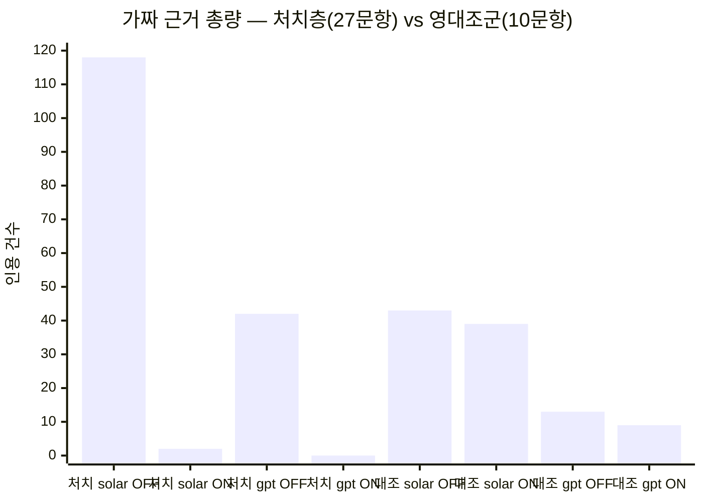

# ICTC 2026 논문 — 2×2 교차모델 실험 · 세무사 독립검증 · IEEE 조판

작성일: 2026-07-29
산출물: `docs/acamedic paper/ICTC2026_draft_v7.docx` (IEEE A4 컨퍼런스 양식, **4페이지**) · 동일 본문 사본 `draft_v7.md`
제출: KICS **ICTC 2026 Track 3**, EDAS <https://edas.info/newPaper.php?c=35149>, 마감 **2026-07-31**
선행: [260719 미학습 30건 영대조군](260719_미학습질문30건_RAG_ONOFF_영대조군검증_누출보정.md) · [260720 리포트2 일반화성능](260720_리포트2_일반화성능_30건_RAG_ONOFF.md)
별첨(미제출): `docs/acamedic paper/qa_citation_suppression.md` — 인용 억제 관련 질의 대응 자료

---

## 0. 이 세션이 한 것 — 한 문장

> **선행 리포트가 남긴 "약한 모델이라 좋아진 것 아니냐"는 반론을 2×2 교차모델 실험으로 닫고, 채점자(LLM)의 신뢰성을 세무사 맹검 검증으로 재보정하고, 학회 양식으로 조판한 뒤, 외부 논문 평가를 받아 8건을 보완했다.**

---

## 1. 왜 2×2 였나 — 선행 실험의 구조적 약점

선행 리포트는 전부 `solar-pro3` 단일 모델이었다. 여기엔 빠져나갈 수 없는 반론이 있다.

> "가짜 근거가 사라진 건 KB 덕분인가, 아니면 원래 약한 모델을 겨우 정상화한 것뿐인가?"

이 반론은 **모델 능력과 RAG 효과가 교락(confound)** 돼 있어서 단일 모델로는 원리적으로 못 푼다. 그래서 축을 하나 더 세웠다.

| | RAG off | RAG on |
|---|---|---|
| **solar-pro3** (국내 중급) | arm 1 | arm 2 |
| **gpt-4.1** (프론티어) | arm 3 | arm 4 |

**설계상 결정적인 부분은 "검색을 문항당 한 번만 실행하고 캐시한다"** 는 것이다. 두 모델 가문이 **바이트 단위로 동일한 주입 컨텍스트**를 받으므로, 차이가 생기면 그건 모델 탓이지 검색 탓이 아니다. 시스템 프롬프트·temperature(0.3)도 공유했다.

`gpt-4.1` 을 고른 이유는 성능이 아니라 **temperature 파라미터를 아직 받는 최신 세대**여서다. 더 최신 세대는 샘플링 파라미터를 못 받아 대조군 동등성이 깨진다.

---

## 2. 누출 차단 — 두 번 다시 잰 이유

테스트 110문항이 KB에 들어가 있으면 실험 전체가 무의미하다. 검증 방식은 **각 질문의 모든 14자 조각을 KB 활성 전문(全文)에 대조**하는 것이다.

여기서 **KB가 계속 자라기 때문에 생기는 함정**을 실측으로 확인했다.

- 1차 검증 후 → 생성 직전 재검증 → **새로 3건 누출 발견**. 그 사이 KB가 커진 탓이다.
- 결론: **성장하는 KB에서는 누출 검증을 "측정 시점마다" 다시 돌려야 한다.** 한 번 통과했다는 사실은 다음 측정에서 아무 것도 보장하지 않는다.

### 2-1. 프로덕션 DB 버그 하나를 이 과정에서 잡았다

31개 대화를 UI의 "연결끊기"로 끊었는데도 누출이 31/31로 남았다. 원인:

> **"연결끊기"가 `feedback` 계열 passage 만 retire 하고 `session_eval` 계열은 건드리지 않았다.** 끊긴 31개 대화에 **59건이 active 로 살아 있었다.**

`/api/rag/retract` 가 그 외에 하는 일이 없고 기여도가 `count(*) where status='active'` 로 **파생 집계**임을 확인한 뒤, 되돌릴 ID 를 백업하고 `store.set_status(ids,'retired')` 로 정리했다. 별도로 **별개 감사된 중복 대화 9건**을 통해 새는 경로도 찾아 끊었다.

---

## 3. 생성 — 440답변, 오류 0

`backend/bulk_ask_multi.py` (신규). 기존 스크립트에서 `SYSTEM_PROMPT` · `retrieve()` · `build_user_prompt()` 를 그대로 import 해 **제품과 동일 경로**를 태웠다.

**중간에 54/110 에서 멈춘 사고**가 있었고, 원인이 두 개였다.

1. **클라이언트 타임아웃 미설정** — SDK 기본 10분 × 재시도. → `timeout=180.0, max_retries=0`
2. **제출 순서로 기록** — 느린 future 하나가 뒤의 완료분 기록을 전부 막았다. → `as_completed` 로 전환

```python
TEMPERATURE = 0.3
CALL_TIMEOUT = 180.0            # SDK 기본 10분은 너무 길다
cl = OpenAI(api_key=..., timeout=CALL_TIMEOUT, max_retries=0)
for i, fu in enumerate(as_completed(futs), 1):   # 제출순서 X → 완료순서 O
    ...
```

### 3-1. Gemini 탈락 (기록해둘 가치가 있음)

키는 정상이었고 모델 목록도 56개가 조회됐는데 호출만 429 `RESOURCE_EXHAUSTED — prepayment credits are depleted`. **쿼터는 키 단위가 아니라 프로젝트 단위**이고, 아내분과 쓰던 공유 프로젝트의 크레딧이 이미 소진돼 있었다. 최소 충전 한도가 $20 이라 **3번째 상용 모델은 실익이 없다고 판단해 드롭**했다. 최종 설계는 2 모델 × 2 조건 = 4 arm.

---

## 4. 채점 — 맹검, 그리고 영대조군

### 4-1. 층 분리

검색 발동(cosine ≥ 0.50, top-5)은 110문항 중 **27건**. 나머지 83건은 주입 코드가 질문을 그대로 통과시켜 **RAG-on 과 RAG-off 프롬프트가 문자 그대로 동일**하다.

> **83/83 문항에서 두 모델 가문 모두 prompt token 수가 완전히 일치함을 확인했다.** 이 층에서 나오는 차이는 정의상 샘플링 잡음과 채점자 편향이지 RAG 가 아니다.

이 83건이 **영대조군(null control)** 이다. 그 중 10건을 채점 시작 **전에** 고정 시드로 사전등록했다.

### 4-2. 결과

맹검 채점: **37문항 × 4답변 = 148답변** (처치 27 + 대조 10). 답변은 A/B/C/D 무작위 위치, arm 라벨·검색정보 은닉. 가짜 근거 총 **266건** 적발.

| 층 / arm | 가짜근거 | 답변당 | 법률정확성(5점) |
|---|---:|---:|---:|
| 처치 solar off | 118 | 4.37 | 1.26 |
| 처치 solar **on** | **2** | **0.07** | **3.22** |
| 처치 gpt off | 42 | 1.56 | 3.81 |
| 처치 gpt **on** | **0** | **0.00** | **4.33** |
| 대조 solar off / on | 43 / 39 | — | — |
| 대조 gpt off / on | 13 / 9 | — | — |



문항별 승부(가짜근거 적은 쪽 승) 이항검정:

| 층 / 모델 | on : off : 무승부 | p |
|---|---|---:|
| 처치 solar-pro3 | **26 : 0 : 1** | < 1e-5 |
| 처치 gpt-4.1 | **23 : 0 : 4** | < 1e-5 |
| 대조 solar-pro3 | 6 : 4 : 0 | 0.754 |
| 대조 gpt-4.1 | 4 : 2 : 4 | 0.688 |

**핵심 세 줄:**

1. **효과가 모델 가문을 건너 재현된다.** 프론티어 모델도 단독으로는 42건을 날조하는데, KB 주입 후 27문항 전체에서 **0건**. → "약한 모델이라서" 반론 종결.
2. **영대조군이 영으로 나온다.** 프롬프트가 동일한 층에서 6:4, 4:2 · 무승부 4 · 총량 거의 불변. → 측정 절차가 결과를 만들어내지 않는다. 위치 편향도 검출되지 않는다.
3. **격차의 77%를 메운다.** 법률정확성 1.26 → 3.22 (무보조 프론티어 3.81). 1차 지표에서는 **국산+KB(0.07) 가 무보조 프론티어(1.56) 보다 낫다.** 쿼리당 비용은 $0.00095 vs $0.00804 로 **9배 차이**.

**비용 관련 반직관적 사실 하나** — RAG 를 켜면 solar arm 이 오히려 싸진다($0.00103 → $0.00095). 주입 컨텍스트가 input 을 늘리지만 답변 길이를 더 크게 줄여서 output 감소가 우세하다.

> ⚠️ **이 절의 3번(77% · 9배)은 이후 외부 평가에서 표현이 교정됐다.** 9배는 벤더 단가차가 지배하므로 방법의 기여가 아니고, 77%는 LLM 5점 기반이라 근거가 약하다. 최종 서술은 [8. 외부 논문 평가 대응](#8-외부-논문-평가-대응--8건-보완) 참조. 또한 인용 총량·환각률 열이 추가돼 이 표는 [8-1](#8-1-지적-21--판단을-두-번-뒤집은-항목)에서 확장됐다.

---

## 5. 반복오류 12패턴 — 본문 주장 하나를 데이터가 뒤집었다

초안 §IV-E 에 *"12개 중 11개가 급감하고 1개만 증가"* 라고 써 있었는데, **채점본 `patterns` 필드를 실제 집계하니 맞지 않았다.**

| | 카테고리 | solar off→on | gpt off→on |
|---|---|---|---|
| P1 | 지출유형 라우팅 회귀 | 1 → **3** ↑ | 0 → 0 |
| P2 | 템플릿 환각 | 1 → **6** ↑ | 0 → 0 |
| P3 | 접대비 오적용 | 0 → 0 | 0 → 0 |
| P4 | 적격증빙 오적용 | 0 → 0 | 0 → 0 |
| P5 | 가짜/오인용 조문·판례 | 26 → 1 ↓ | 11 → 0 ↓ |
| P6 | 근로소득 과세 누락 | 0 → 0 | 0 → 0 |
| P7 | 한도/특례 방향오류 | 24 → 6 ↓ | 6 → 2 ↓ |
| P8 | 되묻기 부재·성급한 단정 | 3 → 1 ↓ | 0 → 0 |
| P9 | 인정금액 산술오류 | 14 → 2 ↓ | 4 → 0 ↓ |
| P10 | 업무/사적 안분 프레임 오적용 | 0 → **2** ↑ | 0 → 0 |
| P11 | 법해석론 라벨 남발 | 0 → 0 | 0 → 0 |
| P12 | 판정 자기모순 | 4 → 2 ↓ | 0 → 0 |

**실제는 5 감소 · 3 증가 · 4 미관측.** 두 모델을 합쳐도 증가가 3개라 어떤 셈법으로도 "11 감소"는 안 나온다. 리뷰어가 원자료를 요구하면 바로 드러날 문장이라 §IV-E 를 전면 교체하고 **TABLE V** 를 신설했다.

대신 데이터에서 **더 강한 주장**이 나왔다.

> **증가한 3개가 전부 solar 쪽이고 gpt 쪽은 증가가 0이다.** 그리고 셋 다 성격이 같다 — **검색된 사실과 현재 질문의 사실을 분리하지 못한** 실패. 즉 RAG 부작용은 **방법 자체의 성질이 아니라 모델 능력에 의존하는 문맥 격리 실패**로 읽힌다.

(n=27 이라 방향으로만 읽으라는 단서를 본문에 같이 달았다. 커버리지가 늘면 같이 늘 것으로 예상.)

---

## 6. 세무사 독립 검증 — 22/30 이 오히려 좋은 소식이었던 이유

채점을 LLM 이 했으므로 그 채점을 사람이 검증해야 한다. 무작위 30건을 뽑아 **정답표를 가리고** 세무사(공저자)께 전달했다.

### 6-1. 맹검 설계에서 잡아낸 누설 3종 (전달 전 수정)

1. 인용 오류가 아닌 **내용 오류가 섞여** 있었다 → 제거
2. 내가 만든 가짜 항목은 `§21`, 실제 항목은 `제21조` — **순수한 표기 형식 단서** → `norm()` 으로 통일
3. 인용 뒤에 *"…을 근거로 인용"* 같은 **판정 어구가 꼬리처럼** 붙어 있었다 → `IS_CITE` 정규식으로 절단

### 6-2. 결과

**22/30 일치.** 30/30 을 가정하고 초안을 썼는데 어긋났지만, **어긋난 방향이 유리했다.**

| | 결과 |
|---|---|
| 채점기가 **가짜로 지목**한 20건 | **19건 결함 확정** (4건 부존재 + 15건 조문은 있으나 표제·내용 불일치), 1건은 맥락상 수용 가능 |
| 채점기가 **정상으로 본** 10건 | 세무사가 **7건 추가 결함** 발견 (5건은 조번호 불일치) |

> **채점기는 가짜를 과소보고한다. 정밀도 19/20 인데 재현율이 낮다. 따라서 표의 수치는 전부 하한값이고, 측정된 효과는 부풀려진 게 아니라 보수적이다.**

양 arm 을 같은 절차로 채점했으므로 **효과의 방향은 보존**된다. 다만 본문에 이 문장을 명시했다:

> *"a reported zero should be read as **'no fabrication detected'** rather than **'provably none.'**"*

### 6-3. 세무사 코멘트가 새 한계 문단이 됐다

> "2016두4822 같은 넘버로 나오는 경우라면 제가 검색할 수 있는 방법으로 다 해도 안 나오는 경우가 있어요. 이런 경우는 검색 안 나온다고 없는 게 아니라 **공개가 안 된 판례**인 경우가 있을 수 있습니다."

**부존재의 증명은 검색 실패로 대체되지 않는다.** 표본 중 2건을 "확정 가짜"가 아닌 **검증 불가**로 재분류하고 §V 에 *Verifying non-existence* 문단을 새로 넣었다. 1차 지표는 **자리표시자 일련번호**와 **실존 조문의 표제 불일치** — 두 지배적 실패 유형 — 에는 신뢰할 수 있고, 그럴듯하게 포맷된 판례번호에는 보수적이다.

---

## 7. 조판 — IEEE A4 양식에서 겪은 것들

### 7-1. Strict OOXML (재발함)

IEEE 템플릿이 **Strict Open XML** 로 저장돼 있어 `python-docx` 가 못 연다 (`officeDocument` 관계 URI 가 `purl.oclc.org` 네임스페이스). zip 내부 XML 의 네임스페이스만 Transitional 로 치환하면 그대로 열린다 → `strict2trans.py`.

> **워드에서 저장할 때마다 Strict 로 되돌아온다.** 이 세션에서만 두 번 재발했다. 저장 시 `다른 이름으로 저장 → **Word 문서 (*.docx)**` 를 고를 것. `Strict Open XML 문서` 아님.

### 7-2. 저자 4명 정렬 — 세 번 시도 끝에 원인을 찾음

증상: 4단으로 배치하면 **1열 저자만 한 줄 위**로 올라감.

- ✗ 1차 — 단락 `space_before`(5pt) 제거. 실패.
- ✗ 2차 — 명시적 단 나누기(column break) 삽입. **오히려 악화.**
- ✓ 3차 — 구조를 보니 **`cols=4` sectPr 을 가진 빈 단락이 2개** 있었고, 근본 원인은 **1열은 "구역(section) 시작"인데 2~4열은 "단(column) 시작"** 이라 워드가 선행 여백·높이 균형을 다르게 처리하는 것이었다. → **구역 방식을 버리고 테두리 없는 1행 4칸 표**로 교체. 표 셀은 항상 상단 정렬이라 어긋날 수가 없다.

### 7-3. 그 외

- **전폭 그림을 2단 본문 안에** 넣기 — `marker(cols=2)` → figure → `caption(cols=1)` → 이후 본문은 최종 sectPr 로 복귀
- **캡션 중복** `Fig. 1. Fig. 1.` — `figure caption`/`table head` 스타일이 자동 번호를 붙이는데 본문에도 수동 접두어를 넣어서. 수동 접두어 6곳 제거
- **그림 글자 키우기** — mermaid 는 **고정 출력 폭**으로 렌더하므로 폰트 크기만 올려도 인쇄물에서는 그대로다. 실제 지렛대는 **가로 콘텐츠를 줄이는 것**. 2행 배치는 81mm 로 너무 높았고, 1행 + 짧은 엣지 라벨이 **16mm @ 12.3pt** (원래 17mm @ 9.2pt)
- **캡션 8pt 는 양식 규정값** — IEEE 는 본문 10pt / 초록·키워드 9pt / **캡션·참고문헌 8pt**. 건드리면 안 됨

---

## 8. 외부 논문 평가 대응 — 8건 보완

조판 완료본(v7)을 외부에 평가 의뢰해 지적서를 받았다. 총평은 *"채택 가능성이 높으며 방법론적 엄밀성은 이 학회 평균을 상당히 웃돈다"* 였고, 핵심 문제 제기는 하나였다.

> **"해석의 폭이 데이터가 허용하는 범위보다 넓다."** — 가짜 인용 감소까지는 데이터가 받쳐주지만, "일반 RAG보다 낫다" "9배 저렴하다" "격차의 77%를 메운다"는 각각 근거가 한 단계씩 약하다.

**새 실험 없이 대응 가능한 것만** 골라 반영했다.

| 지적 | 조치 |
|---|---|
| **2.1** 총 인용 수 / 허구 비율 열 부재 | 표 III에 `Cites`·`Fab.%` 열 신설 (아래 8-1) |
| **2.2** 법령 코퍼스 RAG 대조군 부재 | §V에 *No retrieval baseline over an authoritative corpus* 문단 신설, 최우선 확장으로 선언 |
| **2.3** 초록의 77%가 LLM 5점 기반 | 초록에서 삭제 → 객관 지표(0.07 vs 1.56)로 교체. 본문 77%에는 "인용 수치보다 약한 근거"라고 부기 |
| **2.4** 표 III(≥1)와 표 V(P5) 불일치 | 계수 단위가 다름을 §III-C에 명시 (아래 8-2) |
| **2.5** 비용 9배 과장 | 방법 기여분(동일 모델 내 $0.00103→$0.00095)과 벤더 단가차를 분리. 9배는 "벤더 단가가 지배하며 방법의 성질이 아니다"로 재서술 |
| **3** 신뢰구간 없음 | 정확 이항 95% CI **[0.87, 1.00]**(26/26) · **[0.85, 1.00]**(23/23), 짝지은 부트스트랩 **−4.30 [−4.89, −3.67]** · **−1.56 [−1.93, −1.19]** 추가 |
| **3** 표 I 출처 분리 | "§III 평가셋보다 앞선 별개 100건 세트라 표 III와 직접 비교 불가" 명시 |
| **추가** 인용량 vs 신뢰도 오독 우려 | §IV에 한 문장 추가 (아래 8-3) |

미대응(새 실험 필요): 법령 코퍼스 RAG 실험군 실제 추가 · n 확대 · 다중 도메인/KB. 전부 한계로 명시만 했다.

### 8-1. 지적 2.1 — 판단을 두 번 뒤집은 항목

**1차 판단(틀림).** "가짜 근거 감소가 인용 억제 때문 아니냐"를 확인하려 `answers_long.csv` 440건 전문에서 인용을 기계 추출했다. 결과는 충격적이었다.

| | 답변당 인용 | 인용 0건 답변 | 답변 길이 |
|---|---:|---:|---:|
| solar 처치 off → on | 2.70 → **0.33** | 5/27 → **20/27** | 3,774자 → **898자** |
| gpt 처치 off → on | 3.41 → **0.04** | 0/27 → **26/27** | 1,563자 → 1,188자 |
| solar **대조** off → on | 3.35 → 3.46 | 10/83 → 6/83 | 변화 없음 |
| gpt **대조** off → on | 3.71 → 3.86 | 3/83 → 4/83 | 변화 없음 |

처치층에서 인용이 붕괴하는데 **프롬프트가 동일한 대조층(83건)은 미동도 없다.** 원인이 주입된 KB 구절임이 확정된다 — 영대조군 설계가 없었으면 못 하는 말이다. 극성 라벨의 *"인용하지 말 것"* 지시가 플래그된 블록을 넘어 일반화된 것이다.

이때 **"논지를 약화시킨다"고 판단해 본문에 반영**했다.

**2차 판단(사용자).** 4페이지 학회논문에서 새 발견 하나를 방어하는 데 한 단을 쓰면 본론이 밀린다 → **본문에서 빼고 별첨으로 분리.** 논문은 "가짜 근거 수가 줄었다"만 주장하고 "올바르게 인용하게 된다"고는 말하지 않으므로 생략해도 과장 주장이 생기지 않는다.

**3차 판단(최종).** 외부 평가자가 *"표 III에 열 하나 붙이는 것만으로 정리된다"* 고 재권고. **비율까지 계산하니 결론이 뒤집혔다.**

| 처치층 | 총 인용 | 식별 가짜 | **환각률** |
|---|---:|---:|---:|
| solar off | 73 | 67 | **91.8%** |
| solar **on** | 9 | 2 | **22.2%** |
| gpt off | 92 | 29 | **31.5%** |
| gpt **on** | 1 | 0 | **0.0%** |

> **인용 억제는 분자와 분모를 같이 줄이므로 비율을 못 움직인다.** 92% → 22%, 32% → 0% 는 억제만으로 만들 수 없다. 즉 이 열은 논문의 약점이 아니라 **방어선**이었다. 총량만 보고 판단한 것이 오류였다.

**교훈:** 비율 지표를 낼 수 있는데 총량만 보고 결론 내지 말 것. 방향이 반대로 나올 수 있다.

### 8-2. 계수 단위 문제 — 이 열을 가능하게 만든 기술적 해법

처음엔 이 열이 **계산 불가**였다. 채점기의 가짜 근거 수(118)가 기계 추출 인용 총량(73)보다 커서 그대로 나누면 환각률 162%가 나온다.

원인은 **채점기가 식별번호 없이 이름만 든 근거도 센다**는 것이다 — 예: `국세청 예규 '업무무관 대여금 이자에 대한 인정이자' — 문서번호 없음`. 기계 추출은 식별번호가 있어야 잡는다.

해법은 채점기의 `fake_list` 에서 **판정 주석(`—` 뒤)을 잘라내고 답변 본문과 동일한 정규식을 적용**하는 것이었다. 주석에는 `실제 §31은 손비의 범위` 처럼 **진짜 조문**이 언급돼 있어 그대로 넣으면 오염된다.

```python
def fake_ident(fake_list):        # 판정 주석은 실제 조문을 언급하므로 잘라낸다
    o = set()
    for e in fake_list: o |= cites(re.split(r'[—\-]{1,2}\s', e, maxsplit=1)[0])
    return o
```

이렇게 하니 **`가짜 ⊆ 총인용` 이 채점된 148행 전부에서 성립**했다(위반 0행). 잔여 단위 차이(처치층에서 식별 불가 가짜 solar 7건·gpt 7건)는 §IV 각주로 명시했다.

같은 성격의 문제가 **표 III(≥1) vs 표 V(P5)** 에도 있었다. `solar off 26 = 26` 은 우연 일치이고 `gpt off 23 vs 11` 은 두 배 이상 벌어진다. 표 III은 **기계적 인용 존재검증**, 표 V는 **채점자의 정성 패턴 태그**라 단위가 다르다. §III-C에 "두 값이 일치할 것으로 기대되지 않는다"고 못박았다.

### 8-3. 마지막 코멘트 — 인용량과 신뢰도의 분리

> "gpt 미적용의 인용 수가 92건으로 solar 미적용의 73건보다 많은데 허구율은 32%로 훨씬 낮습니다. '국내 모델이 인용을 남발한다'는 인상과는 반대 방향이라 한 문장 짚어 주면 좋겠습니다."

정규화하면 방향이 더 뚜렷하다.

| | 답변당 인용 | 답변 길이 | 1,000자당 인용 | 환각률 |
|---|---:|---:|---:|---:|
| solar off | 2.70 | 3,774자 | **0.72** | 92% |
| gpt off | 3.41 | 1,563자 | **2.18** | 32% |

**국내 모델은 인용을 남발하지 않는다. 오히려 덜 한다** — 답변이 2.4배 긴데 인용 밀도는 1/3이다. 문제는 양이 아니라 신뢰도다. 이건 §I의 *"실패 양상은 문서의 부재가 아니라 오적용"* 과 같은 이야기라, 한 문장을 넣어 **도입부 주장이 결과 표에서 회수되도록** 했다.

> *"Note also that the domestic model does not fail by citing more: it produces fewer identifiable citations than the frontier model (73 vs 92) in substantially longer answers, yet almost all of them are defective. What distinguishes the two families is citation reliability, not citation volume."*

길이·밀도 수치는 본문에 넣지 않고 *"substantially longer answers"* 로만 표현했다. 길이 차이는 §V 맹검 한계에서 이미 다루므로 중복이다.

### 8-4. 지면 관리

보완 과정에서 한 번 5페이지로 넘어갔다. 되돌린 경로:

1. 인용 억제 문단 제거 → 4페이지 복귀
2. 표 III에 2열 추가 → 4페이지 유지 (열 너비 25/10/10/12/10/10/10mm 고정 + **셀 좌우 여백 1.9mm → 0.3mm**)

> **셀 여백이 좁은 열에서 헤더를 접는다.** `Table Grid` 기본 여백이 좌우 각 1.9mm라 10mm 열의 가용폭이 6.2mm 뿐이었고 `Fabr.` 가 `Fab r.` 로 깨졌다. `tblCellMar` 을 17dxa(0.3mm)로 낮추면 해결된다.

---

## 9. 파일 위치

| | 경로 | 커밋 |
|---|---|---|
| 논문 워드 (제출 원본) | `docs/acamedic paper/ICTC2026_draft_v7.docx` | ✅ |
| 논문 md 사본 (검토용) | `docs/acamedic paper/draft_v7.md` | ✅ |
| **질의대응 별첨 (미제출)** | `docs/acamedic paper/qa_citation_suppression.md` | ✅ |
| 그림 소스 | `docs/acamedic paper/figures/paper_fig{1,2}.mmd` + `mermaid-config.json` | ✅ |
| 변환된 템플릿 | `docs/acamedic paper/form/conference-template-a4_transitional.docx` | ✅ |
| 참고문헌 확인표 | `docs/acamedic paper/references_check.md` | ✅ |
| 세무사 대조표·요청서 | `docs/acamedic paper/verify/` | ✅ |
| 생성 스크립트 | `backend/bulk_ask_multi.py` · `bulk_ask_rag.py` | ✅ |
| **문항셋·답변 원문** | `backend/testset.json` · `answers_long.csv` | ❌ **gitignore** — 답변 전문·KB 발췌 포함 |
| 채점 원자료 | scratchpad `scoring/result_*.json` · `_KEY.json` | ❌ 세션 임시 |

> **주의:** `_VERIFY_KEY.json`(세무사 검증 정답표)은 독립 검증이 끝날 때까지 scratchpad 밖으로 내보내지 않았다. 채점 원자료는 세션 임시 디렉터리에 있어 **세션이 정리되면 사라진다.** 재현이 필요하면 리포로 옮겨야 한다.

---

## 10. 남은 일

- [x] ~~외부 논문 평가 대응~~ — 8건 전부 반영, 4페이지 유지 (§8)
- [ ] **오랄 발표 전 `qa_citation_suppression.md` 숙지** — 인용 억제 질의는 나올 확률이 높다. 답변 순서는 **비율(Fab.%)로 먼저 반박 → 절대량은 인정**
- [ ] **채점 원자료를 리포로 이관** — `scoring/result_*.json`·`_KEY.json` 이 세션 임시 디렉터리에만 있어 세션 정리 시 소멸. §V 에 "원자료를 기록해 제3자가 재검증할 수 있게 했다"고 써 놓았으므로 소실되면 그 문장과 충돌한다. 답변 전문·KB 발췌 포함 여부에 따라 gitignore 판단 필요
- [ ] **EDAS 제출 (7/31 마감)** — Track 3, 저자 4인 전원 등록, PDF 업로드. 이 단계에선 PDF eXpress·저작권·등록 불필요
- [ ] **저자 영문 표기 확인** — 이메일에서 성을 추론한 것이라 특히 `JIN HYO GEUN → Hyo Geun Jin` 확인 필요. **Xplore 에 그대로 실리고 camera-ready 이후 수정 불가**
- [ ] Jin 저자 칸 이메일 끝 **공백 1칸** 제거 (가운데 정렬이라 그 줄만 반 글자 밀림)
- [ ] Choi·Jin 이메일이 기관 메일로 바뀐 것이 의도한 것인지 확인
- [ ] **채택 시 camera-ready (9/10)** — PDF eXpress ID `71249X` · IEEE eCF 저작권 · **Regular 요금** 등록(학생요금 아님, travel grant 조건) · Final Manuscript 업로드. PDF 에 **북마크·URL 금지**
- [ ] API 키 2종 로테이션 (스크린샷에 일부 노출됨)
